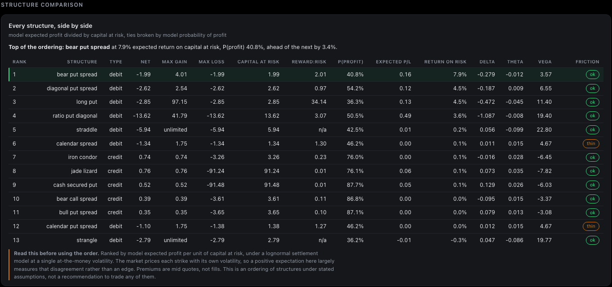
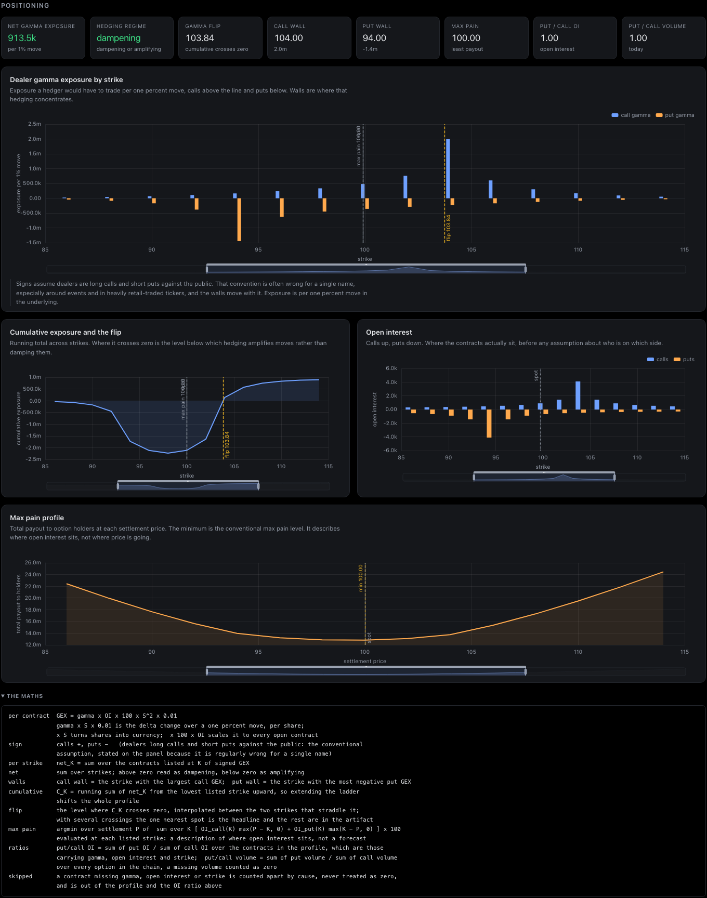
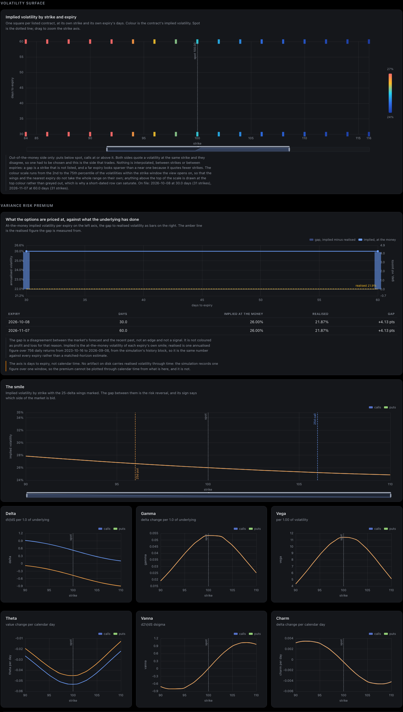
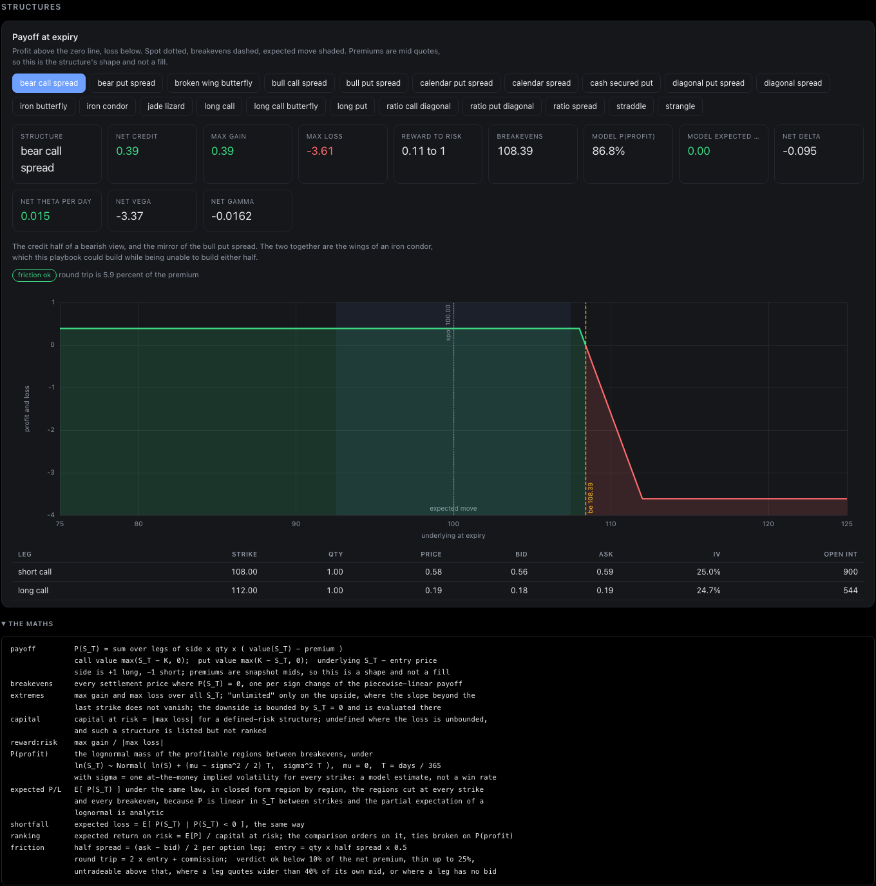
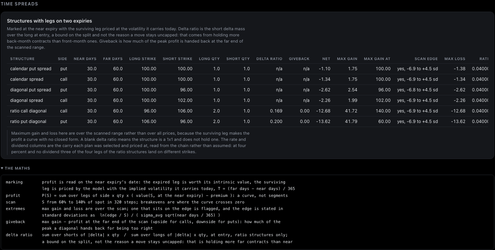
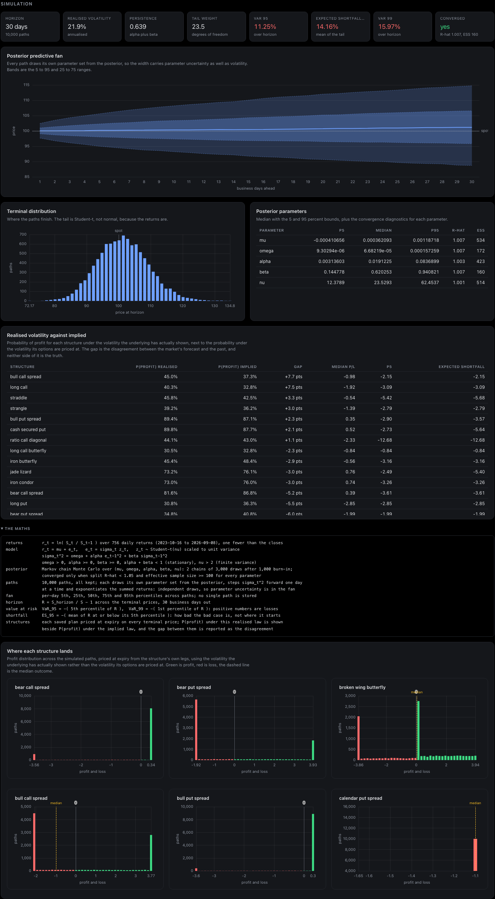
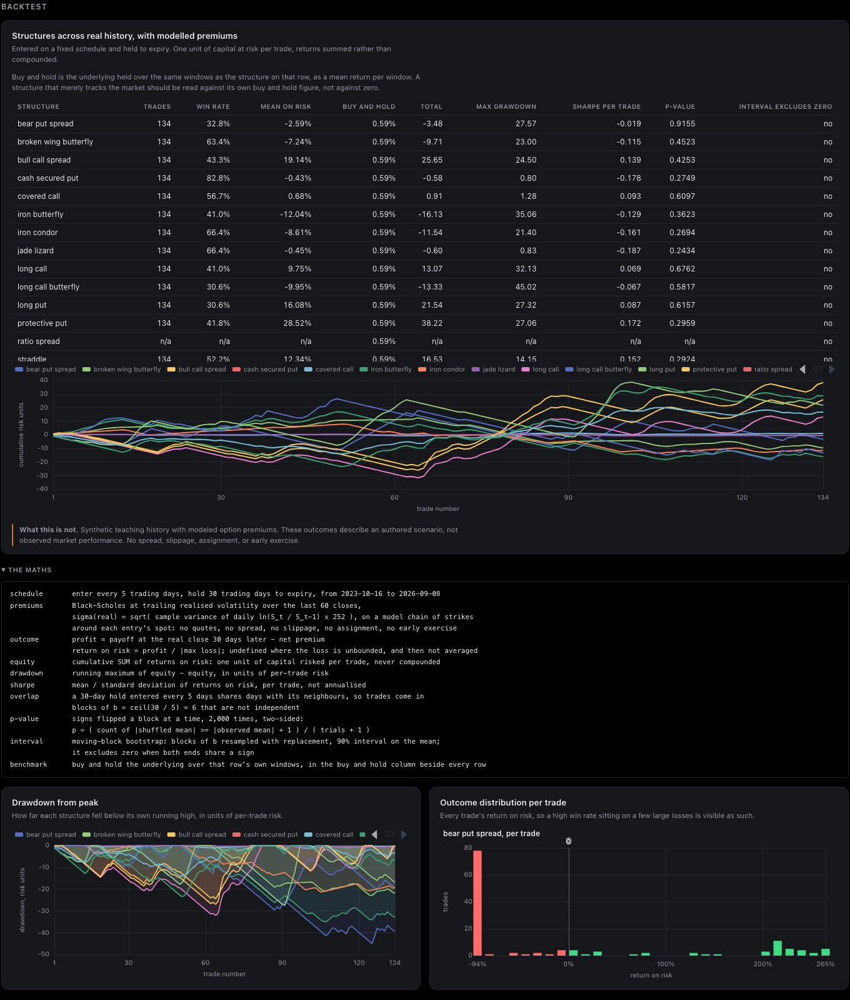
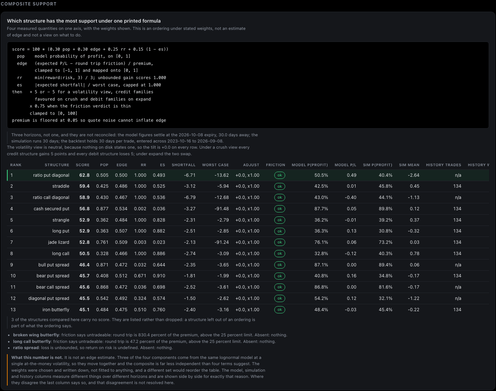
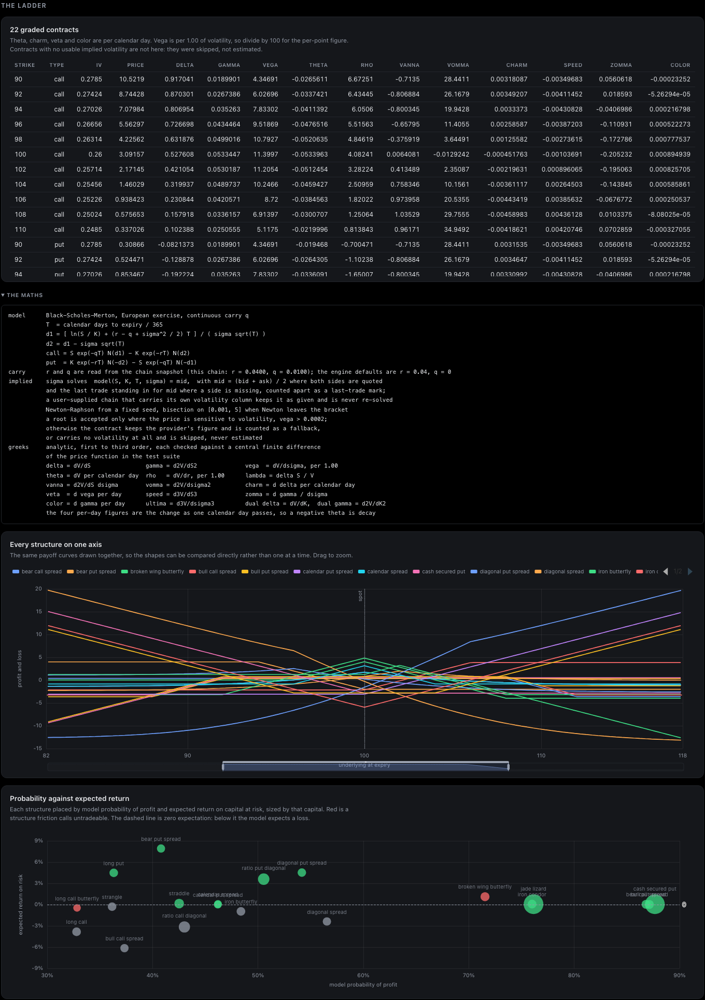
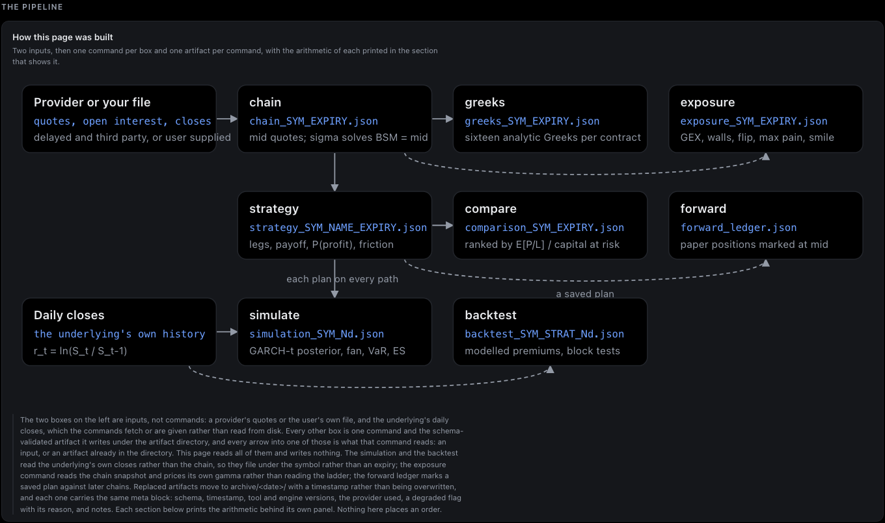

# Option Desk

Options research with a local dashboard, agent skills, and MCP tools.
Import a chain, inspect its Greeks and positioning, compare structures, and keep the results as readable files.

[](https://github.com/Iman/agent-driven-options-desk-and-skills/actions/workflows/refresh.yml) [](docs/TESTING.md) [](docs/TESTING.md#run-the-80-unit-coverage-gate) [](scripts/mutate.py) [](INSTALL.md)

[](LICENSE) [](https://deepwiki.com/Iman/agent-driven-options-desk-and-skills) [](docs/wiki/Skill-Installation.md#choose-the-correct-skill-edition) [](docs/wiki/Skill-Installation.md#prepare-individual-browser-skill-zips) [](docs/CAPABILITIES.md)

[](docs/wiki/Skill-Installation.md) [](https://github.com/Iman/agent-driven-options-desk-and-skills/commits/main)

## Contents

**On this page**

- [See the desk](#see-the-desk)
- [Get started](#get-started)
- [Ask your agent](#ask-your-agent)
- [Follow a research workflow](#follow-a-research-workflow)
- [Read the documentation](#read-the-documentation)
- [Development](#development)
- [Licensing](#licensing)

**Guides and wiki**

- [Wiki](https://github.com/Iman/agent-driven-options-desk-and-skills/wiki)
- [Architecture and diagrams](docs/wiki/Architecture.md)
- [Install skills](docs/wiki/Skill-Installation.md)
- [User guide](docs/wiki/Home.md)
- [Examples](docs/wiki/Examples.md)
- [Install](INSTALL.md)
- [Troubleshooting](docs/wiki/Troubleshooting.md)

## See the desk

The dashboard brings the chain, model assumptions, and research results onto one page.
These are captures of the current local dashboard with synthetic teaching inputs.
They are not market observations or evidence of trading performance.
[Capture details](docs/SCREENSHOT-PROVENANCE.md) distinguish the input scenario from the capture date.



### Dashboard tour

Open an image for its full resolution. The [complete gallery](docs/SCREENSHOTS.md) includes individual panels and charts.
The [dashboard guide](docs/wiki/Dashboard.md) explains how to read them.

| Positioning | Volatility |
|---|---|
|  |  |
| Inspect the assumed dealer exposure and chain coverage. | Compare strikes and expiries without hiding missing values. |

| Structure payoff | Two-expiry structures |
|---|---|
|  |  |
| Read the legs, breakevens, and limits together. | Inspect the valuation assumptions for the surviving leg. |

| Simulation | Backtest |
|---|---|
|  |  |
| Read the fan with the convergence diagnostics. | Read outcomes with the benchmark and model limitations. |

| Composite comparison | Contract ladder |
|---|---|
|  |  |
| Inspect the formula and disagreements between models. | Compare sensitivities and payoff shapes. |



## Get started

Choose one route:

| Your starting point | First action | Continue with |
|---|---|---|
| I want to try it without a data account | Run the supplied sample below. | [First walkthrough](docs/wiki/Getting-Started.md) |
| I use Claude Code or Codex | Install the local tools, then connect the plugin. | [Agent workflows](docs/wiki/Agent-Workflows.md) |
| I have a CSV or JSON chain | Import it with its source and timestamp. | [Data import](docs/wiki/Importing-Data.md) |
| I want a browser-based example | Open the [hosted sample](https://optiondesk.avidquant.com). | [Hosted connection](docs/wiki/Agent-Workflows.md#browser-agents-and-the-hosted-service) |

### Try the supplied sample

Requirements: Git and Python 3.11 or later.
Run these commands on macOS or Linux:

```sh
git clone https://github.com/Iman/agent-driven-options-desk-and-skills.git
cd agent-driven-options-desk-and-skills
python3 -m venv .venv
. .venv/bin/activate
python -m pip install -e ./engine -e ./shell
optiondesk chain SYNTH --from-file examples/chain-synth.json --accept-data-rights --out-dir artifacts/tutorial
optiondesk greeks --out-dir artifacts/tutorial
optiondesk exposure --out-dir artifacts/tutorial
optiondesk compare --out-dir artifacts/tutorial
optiondesk dashboard --out-dir artifacts/tutorial
```

Open **http://127.0.0.1:8787** on the same computer.
Select **SYNTH** and **2026-10-08**.
Press `Ctrl+C` in the terminal to stop the server. The result files remain in `artifacts/tutorial`.

The supplied sample contains 62 synthetic contracts and a fixed valuation scenario.
It needs no external provider after installation.
The [walkthrough](docs/wiki/Getting-Started.md) includes Windows activation, expected results, and the next steps.
[Sample provenance](examples/README.md) explains the inputs.

### Install the full local desk

From a checkout, run:

```sh
./install.sh
optiondesk doctor
```

This installs the local tools and skills and attempts MCP registration with supported runtime CLIs it finds.
[Installation](INSTALL.md) covers paths, flags, Docker, and removal.
A plugin installation alone does not install the local calculation engine.

For an existing local provider setup, run the complete demonstration:

```sh
./run.sh --symbols SPY
```

The runner retrieves data, builds the research artifacts, opens a paper position, and serves the dashboard.
It writes to `~/TradingDesk/option-desk-demo` by default.
Use `--dry-run` to inspect its commands.
Read [provider setup](docs/wiki/Installation.md#local-provider-demo) before enabling Yahoo access.

## Ask your agent

### Install skills in your product

| Product | Installation choices |
|---|---|
| [Codex](docs/wiki/Skill-Installation.md#codex) | `npx`, manual copy, shell installer, or plugin. |
| [Claude Code](docs/wiki/Skill-Installation.md#claude-code) | `npx`, manual copy, shell installer, or plugin. |
| [ChatGPT](docs/wiki/Skill-Installation.md#chatgpt) | Individual hosted-skill uploads where the account supports Skills, plus a separate MCP app. |
| [Claude chat](docs/wiki/Skill-Installation.md#claude-chat) | Individual hosted-skill ZIPs plus a custom MCP connector. |

The [installation guide](docs/wiki/Skill-Installation.md) includes single-skill and all-skill commands, user/project scope, ZIP preparation, and connection checks.

After connecting the local tools, ask:

```text
Use examples/chain-synth.json, the supplied synthetic teaching sample.
I can use this file for private analysis.
Save the results under artifacts/tutorial.
Show its Greeks and positioning, then compare an iron condor with a straddle.
State the source, missing inputs, model assumptions, and degradation first.
```

| What you want | Skill | Example |
|---|---|---|
| Working tools | `desk-setup` | Check why my MCP tools are unavailable. |
| Contract sensitivities | `options-greeks` | Show delta, gamma, theta, and vega from this chain. |
| Chain positioning | `options-positioning` | Show the gamma walls and state the dealer-sign assumption. |
| Multi-leg structures | `options-strategy` | Compare these structures by payoff, loss, and Greeks. |
| Forward distribution | `options-simulation` | Simulate the underlying from permitted history and report convergence. |
| Historical research | `options-backtest` | Backtest this structure and explain the benchmark and missing costs. |

The local MCP server exposes 12 tools.
The hosted service supports a smaller workflow: snapshot validation, Greeks, positioning, and strategy plots.
Simulation and backtests remain local workflows.
See [agent setup and prompts](docs/wiki/Agent-Workflows.md).

## Follow a research workflow

| Step | Action | What to inspect |
|---|---|---|
| 1. Load | [Import a chain](docs/wiki/Importing-Data.md) | Source, timestamp, expiry, and missing inputs. |
| 2. Inspect | Calculate Greeks and positioning. | Units, skip counts, and dealer-sign assumptions. |
| 3. Compare | [Build structures](docs/wiki/Examples.md#compare-two-structures) | Legs, breakevens, maximum loss, and spread costs. |
| 4. Explore time | [Compare two expiries](docs/wiki/Examples.md#compare-two-expiries) | Near-expiry valuation and scan limits. |
| 5. Research history | [Simulate or backtest](docs/wiki/Examples.md#simulate-a-real-underlying-locally) | Convergence, benchmarks, uncertainty, and omitted costs. |
| 6. Record | [Open a paper position](docs/wiki/Examples.md#open-and-mark-a-paper-position) | Plan, thesis, later marks, and unavailable quotes. |

The dashboard reads saved artifacts. It does not fetch new data when you open the page.
Use the same `--out-dir` for related commands and the dashboard.
The [results guide](docs/wiki/Reading-Results.md) explains how to interpret each stage.

## Read the documentation

| Guide | Purpose |
|---|---|
| [User guide home](docs/wiki/Home.md) | Choose a task and follow it to a result. |
| [Installation reference](INSTALL.md) | eight install paths for local, plugin, skills-only, hosted, and container use. |
| [Dashboard tour](docs/wiki/Dashboard.md) | Read the panels and identify missing calculations. |
| [Examples](docs/wiki/Examples.md) | Copyable commands and expected results. |
| [Troubleshooting](docs/wiki/Troubleshooting.md) | Installation, provider, import, and chart problems. |
| [FAQ](FAQ.md) | Common questions and interpretation limits. |
| [Capabilities](docs/CAPABILITIES.md) | Feature and interface catalogue. |
| [Master algorithm](docs/wiki/Algorithm.md) | One pseudocode reference for skills, loops, graph routing, prompts, backtests, and paper tests. |
| [Architecture](docs/wiki/Architecture.md) | Packages, data flow, contracts, current diagrams, and preserved design references. |
| [Preserved project reference](docs/wiki/Reference-README.md) | Complete earlier README, with its engineering detail, measurements, and examples. |
| [API inventory](docs/INVENTORY.md) | Generated public function and class reference. |
| [Documentation map](docs/wiki/Documentation-Map.md) | All guides, policies, and maintenance references. |

## Development

[Testing and coverage](docs/TESTING.md) covers happy and failure paths, BDD scenarios, integration checks, and the 80% unit line-coverage gate per package.

Run from the repository root with the development dependencies installed.
See [Development](docs/wiki/Development.md) for environment setup and screenshot capture.

```sh
python -m pytest engine/tests -q    # 355 tests
python -m pytest shell/tests -q     # 572 tests
python -m pytest agent/tests -q     # 161 tests
python -m pytest -q                # 1088 tests
```

These are collection counts, not a claim that this documentation edit ran every test.
The workflow badge links to the actual CI result.

```sh
python3 scripts/refresh.py --no-index
python3 scripts/mutate.py --list
```

Ten stages in a full run rebuild generated documents and packages, check recorded evidence, and run the suites and repository rules.
The mutation harness defines ninety-nine mutations. Use its output to distinguish detected changes, survivors, and skipped cases.

Eight schemas under `shell/src/optiondesk/contracts/` define the artifact interface: 8 schemas + validator.
See [the architecture guide](docs/wiki/Architecture.md) for their roles.

<details>
<summary>Recorded historical example</summary>

The [evidence record](docs/evidence.json) pins an earlier chain measurement to `2026-08-30T14:12:17+00:00`.
It records `607 contracts, spot, listed expiries` and `595 solved, 12 refused as unidentified`.
These are historical evidence strings, not counts for the sample or the current screenshots.
The recorder retains them here for its existing documentation checks.

</details>

[Contribute](CONTRIBUTING.md) · [Backlog](docs/BACKLOG.md) · [Changelog](CHANGELOG.md) · [Security](SECURITY.md)

## Licensing

The repository uses [PolyForm Noncommercial 1.0.0](LICENSE).
It is source available and free for noncommercial use.
Commercial use requires a separate written agreement. See [LICENSES.md](LICENSES.md).
The software license does not grant rights to provider data.

Research software. No order placement. Model results are not fills, recommendations, or investment advice.
Read the [disclaimer](DISCLAIMER.md), [privacy policy](PRIVACY.md), and [third-party notices](THIRD-PARTY.md).
