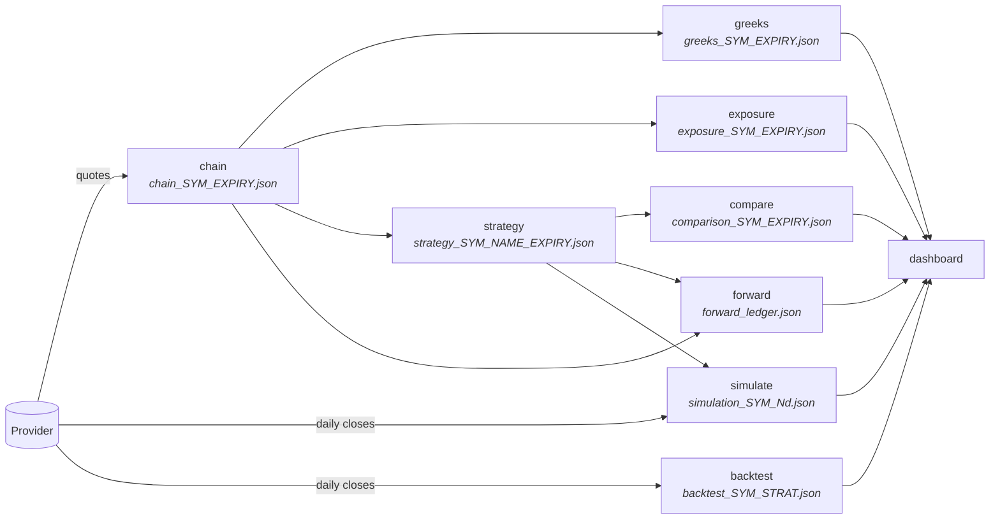
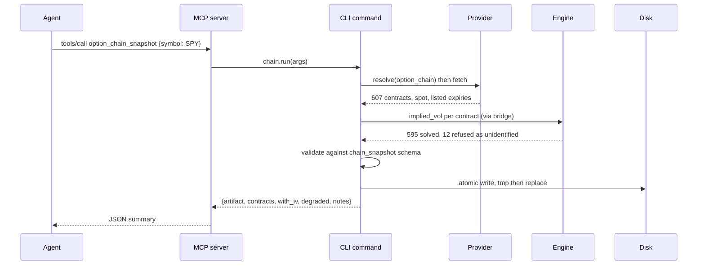
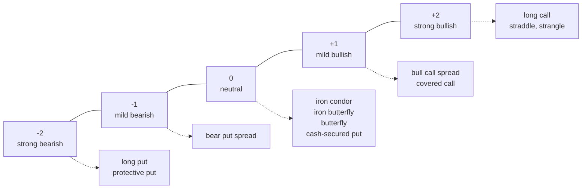
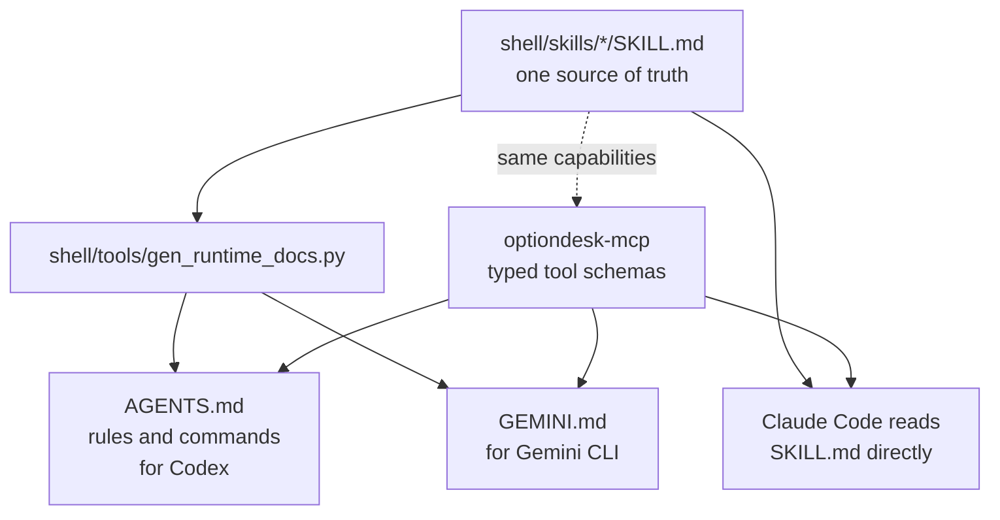
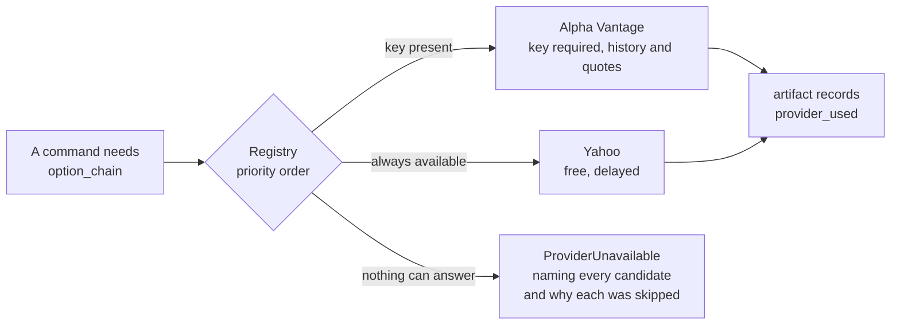
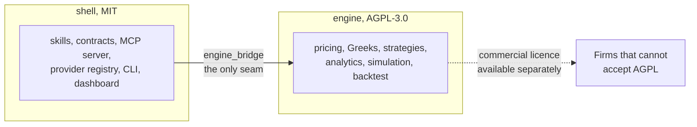

# Option desk

Option analytics that an AI agent can drive, and that a person can read.

Pull a chain from free market data, compute the full Greek ladder, measure
where dealer hedging concentrates, build and rank multi-leg structures,
simulate the underlying forward from its own behaviour, test a rule against
history, and track what you actually took. Every step writes a
schema-validated artifact. A local dashboard renders them.

Research software. Not investment advice, not a recommendation, not a
solicitation. Read [DISCLAIMER.md](DISCLAIMER.md) before using it.

---

## Contents

- [Install](#install)
- [Usage](#usage)
- [Five minutes to a full desk](#five-minutes-to-a-full-desk)
- [Architecture](#architecture)
- [How data flows](#how-data-flows)
- [Command reference](#command-reference)
- [Using it from an agent](#using-it-from-an-agent)
- [The rules this project holds itself to](#the-rules-this-project-holds-itself-to)
- [Artifacts and contracts](#artifacts-and-contracts)
- [Data providers](#data-providers)
- [Asset classes](#asset-classes)
- [The dashboard](#the-dashboard)
- [Extending it](#extending-it)
- [Loops and the graph](#loops-and-the-graph)
- [Development](#development)
- [Documentation map](#documentation-map)
- [What has been verified](#what-has-been-verified)
- [Licensing](#licensing)

---

## Install

Pick by what you want. The first gives you the whole desk; the second and
third give you the skills alone, which work as knowledge with no Python
installed at all.

### Everything: the CLI, the skills, the dashboard, the MCP server

```
curl -fsSL https://raw.githubusercontent.com/Iman/agent-driven-options-desk-and-skills/main/install.sh | bash
```

Or from a checkout, `./install.sh`. Either way it creates a virtualenv
under `~/.optiondesk`, installs the MIT shell and the AGPL engine, links
`optiondesk` and `optiondesk-mcp` into `~/.local/bin`, copies the skills
into `~/.claude/skills` and `~/.agents/skills`, so Claude Code and Codex
each find them, and registers the MCP server with every agent runtime CLI
it finds. Re-running is safe. `./install.sh --uninstall`
reverses it and removes only what it created.

Useful flags: `--dry-run` to see the plan and change nothing, `--no-engine`
for the MIT shell alone, `--skills-only` for no Python at all, `--no-mcp`
to leave runtime configs untouched, `--prefix` to install elsewhere.

### Skills only, through the skills CLI

```
npx skills add Iman/agent-driven-options-desk-and-skills

npx skills add Iman/agent-driven-options-desk-and-skills --skill options-greeks options-strategy

npx skills add Iman/agent-driven-options-desk-and-skills --list
```

The CLI detects which agents you have and asks where to install. Claude
Code reads `.claude/skills/`; universal agents share `.agents/skills/`.

If you run that from inside an agent session, by asking Claude Code to
install them for you, the CLI runs non-interactively and may install only
to `.agents/skills/`, which Claude Code does not read. Name the agent:

```
npx skills add Iman/agent-driven-options-desk-and-skills -a claude-code
```

### In Codex or ChatGPT

```
codex plugin marketplace add Iman/agent-driven-options-desk-and-skills
codex plugin add option-desk@option-desk
```

Codex also finds the skills with no plugin at all. It scans, in order,
`.agents/skills` in the working directory, the same in the parent
directory, the same at the repository root, then `~/.agents/skills` for
your user and `/etc/codex/skills` for the machine. This repository
symlinks the repository-root one to `shell/skills`, and symlinked skill
folders are documented as followed, so cloning it is enough.

Browser ChatGPT is the one place the tools cannot follow. The MCP server is
a local process and a web page cannot run one on your machine, so there the
skills are knowledge and instructions. Each skill says so itself.

### As a Claude Code plugin, which also brings the commands and agents

```
/plugin marketplace add Iman/agent-driven-options-desk-and-skills
/plugin install option-desk@option-desk
```

That adds the five skills, six commands, two agents and the MCP server
declaration in one step. The commands and agents come only through this
path; the skills CLI installs skills.

### From a checkout, by hand

```
git clone https://github.com/Iman/agent-driven-options-desk-and-skills.git
cd agent-driven-options-desk-and-skills
python -m venv .venv && . .venv/bin/activate
pip install -e "shell[yahoo,dev]" -e engine
optiondesk doctor
```

Add `-e agent` for the LangChain bindings and the graph.

`INSTALL.md` covers two more paths, zip upload for claude.ai in the browser
and the MCP server on its own, along with the flags in full.

No API key is needed for any of them. Python 3.11 or newer, and the skills
paths need no Python at all.

---

## Usage

Ask for what you want. The skill that fits loads itself.

```
"What are the Greeks on SPY for the September expiry?"       options-greeks
"Where are the gamma walls on QQQ?"                          options-positioning
"What would an iron condor on TLT pay?"                      options-strategy
"What is the downside on SPY over the next month?"           options-simulation
"Has selling condors on SPY actually worked?"                options-backtest
```

Or drive it directly, either as a command in an agent runtime or on the
terminal:

```
/desk-open SPY                    a chain, a ladder, positioning, every structure ranked
/desk-risk SPY 30                 project forward, then hand it to the risk reviewer
/desk-test SPY iron_condor        backtest and forward test, with the benchmark
/desk-watch SPY                   report only what materially changed
/desk-complete SPY                drive the artifact set to completeness

optiondesk expiries SPY           what is listed, and what you already hold
optiondesk chain SPY              pull it
optiondesk compare                every structure, ranked
optiondesk dashboard              serve the charts at 127.0.0.1:8787
```

The five skills, and when each one fires:

| Skill | Covers |
|---|---|
| `options-greeks` | chains, implied volatility by strike, the sixteen Greeks per contract |
| `options-positioning` | dealer gamma, the walls, the flip, max pain, put-call ratios, skew |
| `options-strategy` | seventeen structures, built, priced and ranked side by side |
| `options-simulation` | GARCH-t Monte Carlo, the fan, value at risk, expected shortfall |
| `options-backtest` | real history with modelled premiums, significance, and paper forward tests |

Every one of them reports what it cannot establish rather than filling it
in, and none of them will recommend a trade.

---

## Five minutes to a full desk

```
optiondesk expiries SPY                  # what is listed, what you have
optiondesk chain SPY --expiry 2026-09-18 # pull it
optiondesk greeks --band 0.06            # sixteen Greeks per contract
optiondesk exposure                      # walls, flip, max pain, smile
optiondesk compare                       # every structure, ranked
optiondesk simulate SPY --horizon 14     # GARCH-t posterior and fan
optiondesk backtest SPY iron_condor      # five years, modelled premiums
optiondesk forward open --strategy iron_condor --thesis "range bound"
optiondesk dashboard                     # http://127.0.0.1:8787
```

Each command prints a JSON summary and writes one artifact. The dashboard
reads artifacts and writes nothing.

---

## Architecture

Three packages under two licences, joined by one adapter. Eight ways in,
one
set of artifacts out.


**Why the boundary exists.** The shell fetches data, validates it and
writes files. The engine turns numbers into analytics. They are separate
packages with separate licences, and `engine_bridge` is the only place the
shell imports the engine, so the boundary is checkable with one grep. An
audit caught a command importing the engine directly; it was harmless at
runtime and it broke the invariant every document here asserts, so it was
routed back through the bridge.

Without the engine installed, the shell still runs: `chain` writes a
degraded snapshot using the provider's published volatility, and `greeks`
returns a structured error telling you to install the engine.

---

## How data flows

Every arrow is an artifact on disk. Nothing is held in memory between
commands, so any step can be re-run, inspected, or replaced.



Two commands take a different input on purpose. `simulate` and `backtest`
read the underlying's price history, not the option chain, because they
answer questions about the underlying's own behaviour. That is why the
dashboard files them under the symbol rather than under an expiry.

### What a single run looks like



Those counts are one real pull, SPY expiring 2026-09-18, taken on
2026-08-30. They are an illustration rather than an invariant: the next
chain has different numbers, and the artifact they came from is
regenerated by the next run.

The twelve refusals matter. A contract whose price carries no volatility
information gets `iv: null` and is counted, never defaulted, because a
guessed volatility produces a complete and entirely fictional Greek ladder
that looks exactly as authoritative as a real one.

---

## Command reference

| Command | What it does | Writes |
|---|---|---|
| `optiondesk expiries [SYM]` | Every expiry a provider lists, with days to expiry, and which you already hold. No symbol lists on-disk only, with no network. | nothing |
| `optiondesk chain SYM` | Retrieve a chain, solve implied volatility per contract. `--expiry`, `--rate`, `--dividend-yield` | `chain_SYM_EXPIRY.json` |
| `optiondesk greeks` | Sixteen Greeks per contract from its own volatility. `--band`, `--type`, `--snapshot` | `greeks_SYM_EXPIRY.json` |
| `optiondesk exposure` | Dealer gamma by strike, walls, flip, max pain, put-call ratios, smile geometry. | `exposure_SYM_EXPIRY.json` |
| `optiondesk strategy NAME` | Build one structure. `--list`, `--recommend N`, `--vol-view`, `--size`, `--owns-underlying`, `--direction-unknown`; and for time spreads `--far-snapshot`, `--kind`, `--offset` | `strategy_SYM_NAME_EXPIRY.json` |
| `optiondesk compare` | Every buildable structure, ranked by expected return on capital at risk. | `comparison_SYM_EXPIRY.json` |
| `optiondesk simulate SYM` | GARCH-t posterior by MCMC, predictive fan, VaR and ES, per-structure distributions. `--horizon`, `--paths`, `--draws` | `simulation_SYM_Nd.json` |
| `optiondesk backtest SYM STRAT` | A structure across real history with modelled premiums, plus significance tests and a benchmark. | `backtest_SYM_STRAT_Nd.json` |
| `optiondesk forward ACTION` | Paper ledger: `open`, `mark`, `close`, `status`. | `forward_ledger.json` |
| `optiondesk keys ACTION` | Provider credentials: `list`, `set`, `unset`, `path`. Values are prompted for with hidden input and never printed in full. | `~/.optiondesk/config.env` |
| `optiondesk doctor` | Engine, providers, credentials, artifact directory. | nothing |
| `optiondesk dashboard` | Serve the dashboard. `--host`, `--port` | nothing |

### The structures

Twelve build from a single expiry: `long_call`, `long_put`,
`bull_call_spread`, `bear_put_spread`, `cash_secured_put`, `covered_call`,
`protective_put`, `straddle`, `strangle`, `iron_condor`, `iron_butterfly`,
`long_call_butterfly`. Two more need a second expiry and build from a
pair of snapshots: `calendar_spread` and `diagonal_spread`, through
`--far-snapshot`, or by letting the command find the next expiry on disk
itself.

Three more are asymmetric by design: `ratio_spread`, financed by selling
more than you buy and therefore uncapped on the short side;
`broken_wing_butterfly`, whose unequal wings remove the risk on one side
and often open for a credit; and `jade_lizard`, a short put against a short
call spread, which carries no upside risk when the credit collected exceeds
the width of that spread. The jade lizard reports whether that condition
actually holds for the legs it selected rather than claiming it
structurally.

Seventeen in all.

Each is tagged with which of the five directions it needs, which is what
`--recommend` ranks against:



Three of the five sit inside the one standard deviation expected move and
two are extreme. A spread reaches maximum profit on a normal move, while a
naked long option needs an extreme one.

---

## Using it from an agent

The same capabilities reach every runtime, three different ways.



Edit a skill, run the generator, and every runtime gets the change. A test
compares the generated text against what is on disk, so a stale
`AGENTS.md` fails the suite.

Those files also carry a command reference read from the argparse parsers
themselves rather than written by hand. Three commands, `expiries`, `keys`
and `dashboard`, have no skill of their own, so without that section a
Codex or Gemini user had no way to learn they were there. A test asserts
every subcommand the real parser exposes appears in both copies, so a
command added later without documentation fails the suite.

The two files differ in what else they carry, and the difference is the
point. Gemini CLI has no skill discovery, so `GEMINI.md` compiles all five
skills into itself. Codex scans `.agents/skills`, which this repository
symlinks to `shell/skills`, so it loads them progressively on its own and
`AGENTS.md` names where they are instead of repeating them. That took it
from 25,851 bytes to 4,366. Embedding them was not merely wasteful, it
defeated the progressive disclosure the skill format exists for.

MCP is the better path where the runtime supports it, because it gives
typed tool schemas instead of prose describing a command line:

```
claude mcp add optiondesk -- /abs/path/to/.venv/bin/optiondesk-mcp
codex  mcp add optiondesk -- /abs/path/to/.venv/bin/optiondesk-mcp
gemini mcp add -s user optiondesk /abs/path/to/.venv/bin/optiondesk-mcp
```

Ten tools are exposed: `option_chain_snapshot`, `option_greeks_ladder`,
`option_expiries`, `option_strategy_build`, `option_strategy_compare`,
`option_positioning`, `option_simulate`, `option_backtest`,
`option_forward_test`, `option_desk_status`.

Five skills ship: `options-greeks`, `options-strategy`,
`options-positioning`, `options-simulation`, `options-backtest`. Each
carries the reporting rules an agent must follow, not just the commands.

---

## The rules this project holds itself to

These are enforced in code and covered by tests, not merely stated.

**A missing number is never a guessed one.** A contract whose price does
not identify a volatility gets `iv: null` and is counted in `counts.without_iv`
on a chain snapshot, and in `skipped.no_iv` on a Greek ladder. The
solver refuses, where it used to hand back its own starting guess for any
contract dominated by intrinsic value. A leg with no later quote makes a
forward position unmarkable instead of marking it at zero. Contracts with
no open interest are excluded from exposure rather than
counted as zero.

**`degraded` and `notes` are different fields.** Degraded means the output
is lower quality than the pipeline can produce: a provider fell back, a
rate could not be fetched, the engine was absent, the snapshot expiry has
passed. Notes record ordinary observations, such as wing contracts with no
quotes. Collapsing them would make every artifact degraded and the flag
worthless.

**Unbounded is not a number.** Maximum gain or loss on a naked structure
serialises as the string `"unlimited"`. JSON has no infinity, null would
erase the distinction between unbounded and unknown, and a large number
would invent a floor that does not exist.

**Modelled premiums are labelled everywhere they appear.** Backtests use
real closes and Black-Scholes premiums at trailing realised volatility.
The artifact carries a statement saying there is no spread, no slippage, no
assignment, no early exercise, and that entry and exit priced by the same
model cannot detect the market disagreeing with that model.

**Assumptions travel with the numbers.** Gamma exposure signs assume
dealers are long calls and short puts, which is often wrong for a single
name. The strategy ranking states that a positive expectation largely
measures the gap between one at-the-money volatility and the market's
smile. Both statements are fields in the artifact, not footnotes in a
document nobody opens.

**Convergence is reported, never assumed.** The MCMC posterior carries
split R-hat and effective sample size per parameter, and a `converged`
flag. When it is false, the quantiles are still written and the artifact
says they should not be quoted.

---

## Artifacts and contracts

Eight schemas under `shell/src/optiondesk/contracts/`. The schema is the
interface: skills, the MCP server, the dashboard and any third-party
consumer read artifacts, never internal Python objects.

| Schema | Artifact | Carries |
|---|---|---|
| `chain_snapshot` | `chain_*.json` | contracts, quotes, per-contract implied volatility and its source |
| `greeks_ladder` | `greeks_*.json` | 16 Greeks per contract, units block, skip counts |
| `exposure` | `exposure_*.json` | gamma by strike, walls, flip, max pain, smile, ratios |
| `strategy_plan` | `strategy_*.json` | legs, risk graph, probabilities, net Greeks, friction, payoff curve |
| `strategy_comparison` | `comparison_*.json` | every structure scored, ranked, with the caveat |
| `simulation` | `simulation_*.json` | posterior, diagnostics, fan, VaR and ES, per-structure distributions |
| `backtest` | `backtest_*.json` | trades, statistics, significance, benchmark, honesty statement |
| `forward_ledger` | `forward_ledger.json` | positions, marks, settlements, thesis |

Every artifact carries the same `meta` block: schema, timestamp, tool,
shell and engine versions, provider used, `degraded` with its reason,
`notes`, the disclaimer and the licence note.

### Nothing is overwritten silently

Filenames are keyed by underlying and expiry, so re-pulling the same chain
replaces the previous one. That used to be the end of it, and it is a
quieter problem than it looks: the chain behind the "595 solved, 12
refused" figures above reported 590 and 17 six hours later, so a sentence
that was carefully measured had become unprovable from anything on disk,
with nothing to say so.

The outgoing artifact now moves into `archive/<date>/` first, under a name
carrying the time it was generated:

```
~/TradingDesk/option-desk/
  chain_SPY_2026-09-18.json                              the newest
  archive/2026-08-30/
    chain_SPY_2026-09-18_20260830T141217Z.json           the one it replaced
```

The live name never changes. Every consumer resolves artifacts by that
name, so the dashboard, `expiries`, the plan reuse in `compare` and the
graph's stage check are all untouched. The
timestamp goes on the copy that is leaving. Identical bytes are not
archived, because re-running a command is not a new measurement.
`OPTIONDESK_ARCHIVE=0` turns it off, and pruning is left to you: nothing
here deletes your data.

### Figures quoted in the documentation

`docs/evidence.json` records each documented number with the artifact it
came from, when that artifact was generated, which provider answered, and
whether it was degraded. `scripts/evidence.py record` writes it, deliberately
and by hand; `scripts/evidence.py check` verifies the documents still agree,
and the refresh runs the check but never the record. A refresh that
re-recorded would make the documented number follow whatever is on disk
today, which is the failure this file exists to prevent.

A claim pins the measurement it describes, so the recorder reads the
archived artifact rather than the newest one with the same name. What is
stored is derived figures only, a few kilobytes, no provider data:
`LICENSES.md` tells you redistribution is governed by the provider's terms,
and this project should not then ship a chain.

Validation uses `jsonschema` when installed and a small built-in subset
validator when not, so a fresh clone validates its own output with nothing
but the standard library. Cross-file references are refused outright rather
than skipped silently, which is what previously left two artifact types
with an unvalidated `meta` block.

---

## Data providers

Skills and commands never name a provider. They ask for a capability, and a
registry answers.



Capabilities: `option_chain`, `underlying_quote`, `risk_free_rate`,
`underlying_history`, `dividend_yield`. Yahoo supplies all four with no key. Alpha Vantage
ships as well and covers underlying history and quotes, sitting below
Yahoo in the priority for both because its free tier allows roughly
twenty-five requests a day. A provider whose key is absent is skipped
rather than failing, so adding another is a class plus one line of
priority.

Naming a provider with `--provider` is strict: if it cannot answer, the
command fails rather than quietly serving a different source. Pass
`strict=False` in code to allow the fallback.

Keys resolve from a CLI flag, then the environment, then `.env` in the
working directory, then `~/.optiondesk/config.env`. They are read, never
written, never logged and never copied into an artifact.

A licence on this software grants no rights over the data it retrieves.
Each provider's terms govern that.

---

## Asset classes

Every class below works today through the same pipeline. Nothing needed
adding for them; what was missing was anyone saying so, and a dividend
yield that was wrong for the ones that pay.

| Class | Reach it through | Chain size measured 2026-08-30 |
|---|---|---|
| Index options | `^SPX`, European and cash settled | 843 contracts |
| Equity and ETF | `SPY`, `AAPL`, any listed name | 492 |
| Rates and bonds | `TLT`, `IEF`, `SHY` | 43 |
| Metals | `GLD`, `SLV` | 145 |
| Energy | `USO`, `UNG` | 71 |
| Crypto | `BITO`, `IBIT` | 35 |
| FX | `FXE`, `FXY`, `FXB` | 56 |

Two limits. The free provider carries
no option chains for futures or FX spot: `ES=F`, `CL=F`, `GC=F`,
`EURUSD=X` and `^TNX` all return price history and zero expiries, which is
why the exchange-traded proxies are the route. And the engine prices
European exercise, which is exact for index options and an approximation
for the American-style ETF options above, understating the value of a deep
in-the-money put most.

### The dividend yield is fetched

`--dividend-yield` used to default to zero, which sounds conservative and
is simply wrong for anything that pays. Measured on a real 173-day TLT
chain against its actual 4.7 percent trailing yield:

| | assumed zero | real yield |
|---|---|---|
| at-the-money implied volatility | 0.0737 | 0.1133 |
| delta | 0.635 | 0.491 |

Understated by 54 percent and overstated by 23 percent respectively, and
every Greek, probability and structure built on it inherits that.

The yield now comes from dividends actually paid over the trailing year,
divided by spot, with the provider's own published figure as a cross-check.
When the two disagree by more than a quarter, neither is used: BITO's
option-income distributions compute to 38.8 percent against a published
61.7, and picking a side there would be a guess wearing a number's
clothing. A cash index is refused too, because it carries no dividend
series of its own and reporting zero would be indistinguishable from gold,
which genuinely pays nothing. In both cases the artifact is degraded, the
reason says so, and `--dividend-yield` remains the override.

### Futures and FX pricing, with no data behind it

`engine/pricing/forwards.py` has Black-76 for options on futures and
Garman-Kohlhagen for currency options, both as substitutions into the same
Black-Scholes-Merton core so they inherit its guards and its numerics. They
are tested against the published formulae written out independently, on put
call parity, and on the identity that a currency option equals a futures
option on the forward those rates imply.

No command calls them, because no provider here can feed them. They are
capability for someone bringing their own quotes, and the module says so in
its first paragraph rather than looking like part of a working pipeline.

---

## The dashboard

```
optiondesk dashboard          # http://127.0.0.1:8787
```

FastAPI when installed, standard library otherwise. Apache ECharts is
vendored, so the page renders with no network access and no third-party
request from the viewer's browser. It reads artifacts and never writes
them, so it cannot corrupt a run in progress.

Sections: a selector for underlying and expiry built from what is on disk,
structure comparison, positioning (gamma by strike, cumulative profile,
open interest, max pain), volatility (smile with 25-delta wings, six Greek
small multiples), structures (payoff with spot, breakevens and expected
move), simulation (posterior fan, terminal distribution, parameter table
with diagnostics, realised against implied), backtest (statistics table and
equity curves), and the ladder.

Every view is addressable: `?u=SPY&e=2026-09-18`.

---

## Extending it

**A new provider.** Subclass `Provider`, declare `capabilities` and whether
it `requires_key`, implement the methods, register it, add its name to
`PRIORITY` above `yahoo`. Nothing else changes: it is selected when its key
is present and skipped when it is not.

**A new structure.** Write a builder that takes a split chain and returns
legs, add an entry to `PLAYBOOK` with its trade type, the outlooks it needs
and when to use it. The payoff engine, the comparison, the backtest and the
forward test all pick it up automatically.

**A new skill.** Add `shell/skills/<name>/SKILL.md` with `name` and
`description` frontmatter, run `python3 shell/tools/gen_runtime_docs.py`. Codex
and Gemini get it in the same commit.

**A new artifact type.** Add the schema, register it in
`contracts/__init__.py`, write the command, and add it to the dashboard's
`KINDS`.

---

## Loops and the graph

Five ways to make this repeat, and they are not the same thing.

| kind | how | command |
|---|---|---|
| turn based | you ask, it finishes | `/desk-open SPY` |
| goal based | stop when a checkable condition holds | `/goal run /desk-complete SPY until every criterion is met, stop after
5 tries.` |
| time based | run again every so often | `/loop 6h run /desk-watch SPY` |
| scheduled | outside the session entirely | `cron` or `launchd`, because `/schedule` runs in the cloud and cannot reach a local desk |
| graph | inside an application you build | `open_desk("SPY", budget=8)` |

Two commands exist specifically to be looped. `/desk-complete` has six
mechanical exit criteria, so an evaluator can check them without judgement.
`/desk-watch` has six named thresholds and stays silent below all of them,
because a recurring command that restates everything trains you to ignore
it.

The graph is separate: a LangGraph state machine in
`agent/src/optiondesk_agent/graph.py` whose gather node runs one missing
stage per visit and loops until the artifact set is complete, the step
budget is spent, or a stage fails. Three distinct outcomes, no model in the
loop, every node deterministic.

`LOOPS.md` covers what makes a good loop here and what does not. No loop in
this project places an order.

---

## Development

One command rebuilds everything generated and then proves it still holds
together:

```
python3 scripts/refresh.py
```

Ten stages in a full run, and the exit code reflects all of them: runtime docs from the
skills, `docs/INVENTORY.md` from the source, the installable forms in
`dist/` and `plugin/`, the CodeGraph index, the three test suites, and a
house-rules scan that fails on an ANSI escape, an emoji, an em dash or
anything shaped like a provider key. `--fast` skips the suites, `--no-index`
skips the index.

All three at once, from the repository root:

```
./shell/.venv/bin/python -m pytest -q          # 569 tests
```

That works because of `pytest.ini`, and it did not until recently: the
default import mode puts every test directory on `sys.path` as a top level
namespace, so the agent package's `conftest` shadowed the shell's and the
two `test_artifacts.py` files collided. Nine modules failed to collect and
the project looked broken when it was not.

Or one suite at a time:

```
./shell/.venv/bin/python -m pytest engine/tests -q    # 292 tests
./shell/.venv/bin/python -m pytest shell/tests -q     # 359 tests
./shell/.venv/bin/python -m pytest agent/tests -q     # 158 tests
```

Those three counts are checked by `shell/tests/test_documented_counts.py`, which
fails when a number in the documentation stops matching the thing it counts.
Every count in the docs rotted at least once before that test existed.

```
```

One local hazard before you edit anything here. If `cat` is
aliased to a syntax highlighter, as it is on the development machine
(`highlight -O ansi --force`), then reading a file through the shell and
writing the result back embeds ANSI colour codes into the source. It has
happened three times in this tree. Use `/bin/cat`, and let the refresh's
rules stage catch what slips through.

Breaking the code on purpose, to check the tests notice:

```
python3 scripts/mutate.py           forty-three mutations, killed or survived
python3 scripts/mutate.py --list    what it would try
```

A survivor is a hole in the suite rather than a bug in the code. A mutant
that provably cannot change behaviour is recorded as equivalent with the
argument for why, so that "we could not kill it" never quietly becomes "we
chose not to".

The code index is [CodeGraph](https://github.com/colbymchenry/codegraph),
`npm i -g @colbymchenry/codegraph`. It turns the tree into symbols and call
edges, so `codegraph explore "implied volatility guard"`,
`codegraph node all_greeks`, `codegraph impact bs_price` and
`codegraph affected <file>` answer structural questions without grepping.
It is optional, the refresh skips it with a note when it is absent, and
`.codegraph/` is machine-local and git-ignored. `codegraph install` registers
it as an MCP server so an agent can query the index directly, and
`codegraph sync -q` in a `post-commit` hook keeps it current between
refreshes. Neither is done for you: an index is the developer's choice, not
the project's.

The engine is standard library only, with no network access and no file
system opinions, which is what makes it testable against closed-form and
finite-difference benchmarks. The shell holds everything that touches the
outside world.

Test conventions, before you add one. Greeks are checked
against central finite differences of the price function they claim to
differentiate, with relative tolerances and no absolute floor: an earlier
version scaled by `max(1, |expected|)`, which left three Greeks untested
with nothing to show for it, and mutation testing found fourteen surviving
defects.
That harness is in the tree as `scripts/mutate.py`, so it is checkable
rather than a claim about the past. It breaks the code forty-three ways and
reports
which breakages the tests notice. Run it. Its current result is forty-two
killed and one proven equivalent, and getting there closed two real holes
it found, the inner vega guard in the implied volatility solver and the
ranking of a non-finite expectation. Every defect fixed since then has a
mutation of its own, because a fix without one is a fix nobody notices
being undone. Statistical
properties are tested as frequencies across several datasets rather than as
outcomes on one, because a 90 percent interval is supposed to miss one time
in ten. The MCMC is validated by recovering parameters it was given.

---

## What has been verified

Measured, not asserted:

- Fifteen of sixteen Greeks match central finite differences of `bs_price`
  across five parameter sets, both option types, with and without a
  dividend yield. Elasticity is a ratio, so it is checked against its
  definition. Mutation testing confirms a sign flip, a zeroing or a dropped
  term in any of the sixteen now fails the suite.
- The GARCH-t sampler recovers parameters it was given, with coverage
  measured across three datasets, and reports non-convergence honestly when
  effective sample size falls short.
- Closed-form probability of profit and tail statistics agree with a seeded
  Monte Carlo draw from the same distribution.
- The MCP server answers a real stdio session: the tool list, a status
  call, and both time spreads built end to end over JSON-RPC. That is
  reproducible from `shell/tests/test_mcp_server.py`, which drives every
  tool rather than only the one that reads nothing.
- Audits by a grounded-engineering agent found defects that are now fixed
  and covered by regression tests. The ones worth naming, each with its
  test: an implied volatility solver that returned its own seed as a
  measurement and a second identifiability guard that had no test at all,
  a mid-price rule that substituted stale trades on 37 percent of a live
  chain, an uninstaller that could delete a directory it did not create, an
  MCP server that executed notifications and answered them, LangChain tool
  bindings that discarded every argument they were given, and six commands
  that wrote a degraded flag into the artifact and printed a summary with
  no trace of it.

Two things that were claimed here and could not be checked from the
repository have been dealt with rather than left standing. "Mutation
tested" is now `scripts/mutate.py`, in the tree and runnable. A claim that
Codex had been observed driving the tools live, and a note about a Gemini
account tier, rested on a terminal session that no longer exists; both are
gone, replaced by the test above, which anyone can run.

---

## Documentation map

| file | what it holds |
|---|---|
| `README.md` | this: architecture, flow, conventions, the reasoning |
| `docs/CAPABILITIES.md` | the complete catalogue of every feature and surface |
| `docs/INVENTORY.md` | every public function and class, generated from the source |
| `scripts/refresh.py` | rebuild everything generated, then prove it holds |
| `scripts/mutate.py` | break the code on purpose and check the tests notice |
| `INSTALL.md` | eight install paths, each verified |
| `LOOPS.md` | the four loop kinds, and what makes a good loop here |
| `FAQ.md` | the questions people actually ask |
| `AGENTS.md` | project rules and the command inventory for Codex, which loads the skills itself from `.agents/skills` |
| `GEMINI.md` | the same plus all five skills compiled in, because Gemini CLI discovers none |
| `DISCLAIMER.md` | what this is not, and what you are responsible for |
| `LICENSES.md` | the two licences and where the boundary sits |
| `THIRD-PARTY.md` | what is vendored and under what terms |
| `CLA.md`, `CONTRIBUTORS.md` | contribution terms |

The generated ones are rebuilt by `python3 scripts/refresh.py`. Editing
them by hand is wasted work.

---

## Licensing

`shell/` is MIT: take it, embed it, sell it. `engine/` is AGPL-3.0: run it
privately however you like, but publish your modifications if you run a
modified version as a network service. A commercial licence for the engine
is available from the copyright holder.



Full detail, and the two rules that keep dual licensing possible, are in
[LICENSES.md](LICENSES.md). Provenance of every borrowed line is recorded
in [THIRD-PARTY.md](THIRD-PARTY.md). Contributions to the engine require
the agreement in [CLA.md](CLA.md).

Read [DISCLAIMER.md](DISCLAIMER.md). It states that this is software
rather than advice, that the author holds no regulated status, that
modelled results are not achievable results, and what your
responsibilities are.
