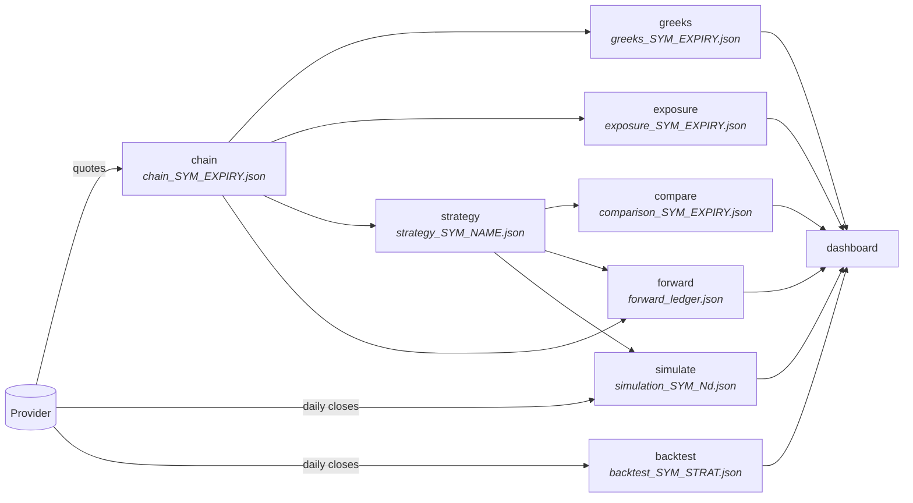
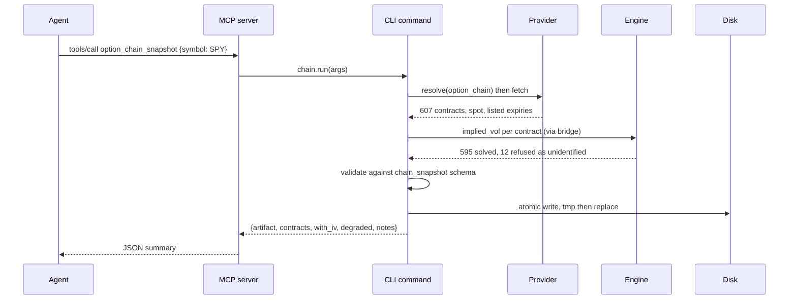
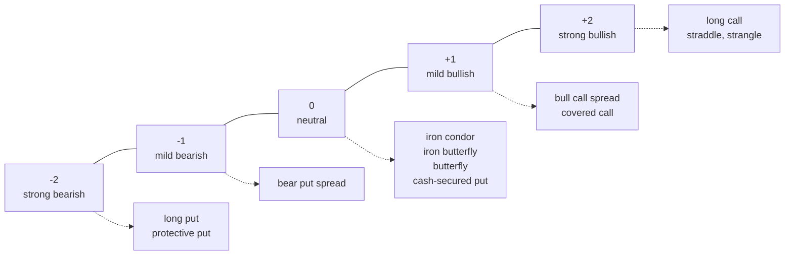
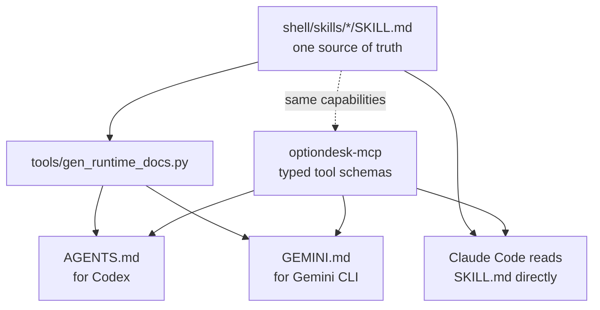
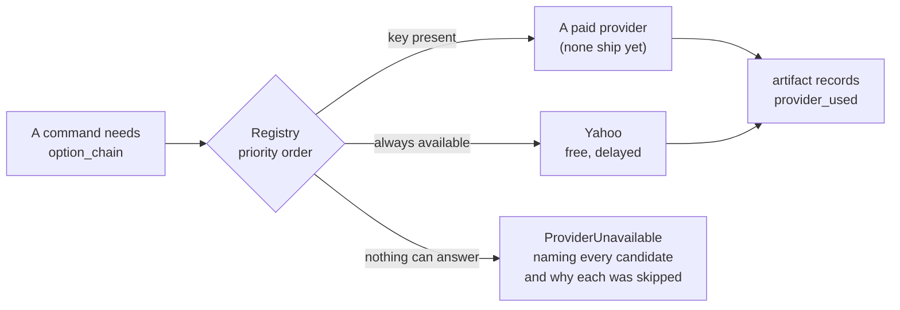
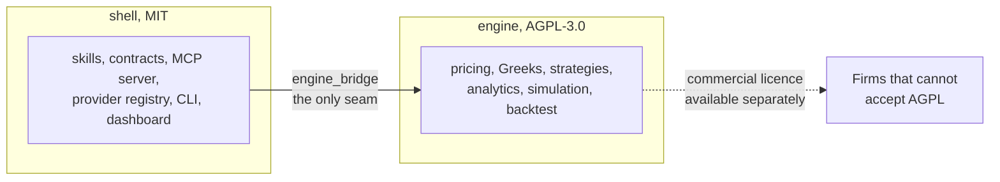

# Option desk

Option analytics that an AI agent can drive, and that a person can read.

Pull a chain from free market data, compute the full Greek ladder, measure
where dealer hedging concentrates, build and rank multi-leg structures,
simulate the underlying forward from its own behaviour, test a rule against
history, and track what you actually took. Every step writes a
schema-validated artifact. A local dashboard renders them.

Research software. Not investment advice, not a recommendation, not a
solicitation. Read [DISCLAIMER.md](DISCLAIMER.md) before using it.

---

## Contents

- [Install](#install)
- [Five minutes to a full desk](#five-minutes-to-a-full-desk)
- [Architecture](#architecture)
- [How data flows](#how-data-flows)
- [Command reference](#command-reference)
- [Using it from an agent](#using-it-from-an-agent)
- [The rules this project holds itself to](#the-rules-this-project-holds-itself-to)
- [Artifacts and contracts](#artifacts-and-contracts)
- [Data providers](#data-providers)
- [The dashboard](#the-dashboard)
- [Extending it](#extending-it)
- [Development](#development)
- [What has been verified](#what-has-been-verified)
- [Licensing](#licensing)

---

## Install

```
./install.sh
```

That creates a virtualenv under `~/.optiondesk`, installs the MIT shell and
the AGPL engine, links `optiondesk` and `optiondesk-mcp` into
`~/.local/bin`, copies the skills into `~/.claude/skills`, and registers the
MCP server with every agent runtime CLI it finds. Re-running is safe.
`./install.sh --uninstall` reverses it and removes only what it created.

Useful flags: `--dry-run` to see the plan and change nothing, `--no-engine`
for the MIT shell alone, `--no-mcp` to leave runtime configs untouched,
`--prefix` to install elsewhere.

Manual install:

```
python -m venv .venv && . .venv/bin/activate
pip install -e "shell[yahoo,dev]" -e engine
optiondesk doctor
```

No API key is needed. Python 3.11 or newer.

---

## Five minutes to a full desk

```
optiondesk expiries SPY                  # what is listed, what you have
optiondesk chain SPY --expiry 2026-09-18 # pull it
optiondesk greeks --band 0.06            # sixteen Greeks per contract
optiondesk exposure                      # walls, flip, max pain, smile
optiondesk compare                       # every structure, ranked
optiondesk simulate SPY --horizon 14     # GARCH-t posterior and fan
optiondesk backtest SPY iron_condor      # five years, modelled premiums
optiondesk forward open --strategy iron_condor --thesis "range bound"
optiondesk dashboard                     # http://127.0.0.1:8787
```

Each command prints a JSON summary and writes one artifact. The dashboard
reads artifacts and writes nothing.

---

## Architecture

Two packages with two licences, joined by one adapter. Four ways in, one
set of artifacts out.

```mermaid
flowchart TB
    subgraph clients["Ways in"]
        claude["Claude Code<br/>reads SKILL.md"]
        codex["Codex<br/>reads AGENTS.md"]
        gemini["Gemini CLI<br/>reads GEMINI.md"]
        human["A person<br/>types commands"]
    end

    mcp["MCP server<br/>stdio, standard library only<br/>10 tools"]
    cli["CLI<br/>optiondesk chain, greeks, exposure,<br/>strategy, compare, simulate,<br/>backtest, forward"]

    subgraph shell["shell &nbsp;(MIT)"]
        providers["Provider registry<br/>resolve by capability,<br/>not by vendor"]
        contracts["JSON contracts<br/>7 schemas + validator"]
        artifacts["Artifact writer<br/>atomic, provenance,<br/>degraded and notes"]
        bridge["engine_bridge<br/>THE ONLY IMPORT<br/>OF THE ENGINE"]
    end

    subgraph engine["engine &nbsp;(AGPL-3.0)"]
        pricing["pricing<br/>Black-Scholes-Merton,<br/>16 Greeks, implied vol"]
        strategies["strategies<br/>payoff, playbook,<br/>outlook, friction"]
        analytics["analytics<br/>gamma exposure, walls,<br/>max pain, smile, ranking"]
        simulation["simulation<br/>GARCH-t by MCMC,<br/>paths, VaR and ES"]
        backtest["backtest<br/>runner, statistics,<br/>forward marking"]
    end

    yahoo[("Yahoo<br/>free, delayed")]
    disk[("Artifact directory<br/>~/TradingDesk/option-desk")]
    dash["Dashboard<br/>FastAPI or stdlib,<br/>ECharts vendored"]

    claude --> mcp
    codex --> mcp
    gemini --> mcp
    human --> cli
    mcp --> cli
    cli --> providers
    cli --> bridge
    providers --> yahoo
    bridge --> pricing
    bridge --> strategies
    bridge --> analytics
    bridge --> simulation
    bridge --> backtest
    cli --> contracts
    contracts --> artifacts
    artifacts --> disk
    disk --> dash

    style engine fill:#2d1b3d,stroke:#7c3aed
    style shell fill:#0f2942,stroke:#2f6feb
    style bridge fill:#3d2b1b,stroke:#b45309
```



**Why the boundary exists.** The shell fetches data, validates it and
writes files. The engine turns numbers into analytics. They are separate
packages with separate licences, and `engine_bridge` is the only place the
shell imports the engine, so the boundary is checkable with one grep. An
audit caught a command importing the engine directly; it was harmless at
runtime and it broke the invariant every document here asserts, so it was
routed back through the bridge.

Without the engine installed, the shell still runs: `chain` writes a
degraded snapshot using the provider's published volatility, and `greeks`
returns a structured error telling you to install the engine.

---

## How data flows

Every arrow is an artifact on disk. Nothing is held in memory between
commands, so any step can be re-run, inspected, or replaced.



Two commands take a different input on purpose. `simulate` and `backtest`
read the underlying's price history rather than the option chain, because
they answer questions about the underlying's own behaviour. That is why the
dashboard files them under the symbol rather than under an expiry.

### What a single run looks like



The twelve refusals matter. A contract whose price carries no volatility
information gets `iv: null` and is counted, never defaulted, because a
guessed volatility produces a complete and entirely fictional Greek ladder
that looks exactly as authoritative as a real one.

---

## Command reference

| Command | What it does | Writes |
|---|---|---|
| `optiondesk expiries [SYM]` | Every expiry a provider lists, with days to expiry, and which you already hold. No symbol lists on-disk only, with no network. | nothing |
| `optiondesk chain SYM` | Retrieve a chain, solve implied volatility per contract. `--expiry`, `--rate`, `--dividend-yield` | `chain_SYM_EXPIRY.json` |
| `optiondesk greeks` | Sixteen Greeks per contract from its own volatility. `--band`, `--type`, `--snapshot` | `greeks_SYM_EXPIRY.json` |
| `optiondesk exposure` | Dealer gamma by strike, walls, flip, max pain, put-call ratios, smile geometry. | `exposure_SYM_EXPIRY.json` |
| `optiondesk strategy NAME` | Build one structure. `--list`, `--recommend N`, `--vol-view`, `--size` | `strategy_SYM_NAME_EXPIRY.json` |
| `optiondesk compare` | Every buildable structure, ranked by expected return on capital at risk. | `comparison_SYM_EXPIRY.json` |
| `optiondesk simulate SYM` | GARCH-t posterior by MCMC, predictive fan, VaR and ES, per-structure distributions. `--horizon`, `--paths`, `--draws` | `simulation_SYM_Nd.json` |
| `optiondesk backtest SYM STRAT` | A structure across real history with modelled premiums, plus significance tests and a benchmark. | `backtest_SYM_STRAT_Nd.json` |
| `optiondesk forward ACTION` | Paper ledger: `open`, `mark`, `close`, `status`. | `forward_ledger.json` |
| `optiondesk doctor` | Engine, providers, credentials, artifact directory. | nothing |
| `optiondesk dashboard` | Serve the dashboard. `--host`, `--port` | nothing |

### The structures

Eleven build from a single expiry: `long_call`, `long_put`,
`bull_call_spread`, `bear_put_spread`, `cash_secured_put`, `covered_call`,
`protective_put`, `straddle`, `strangle`, `iron_condor`, `iron_butterfly`,
`long_call_butterfly`. Two are declared and refuse to build because they
need two expiries: `calendar_spread`, `diagonal_spread`. They are in the
registry rather than omitted so the gap is visible.

Each is tagged with which of the five directions it needs, which is what
`--recommend` ranks against:



Three of the five sit inside the one standard deviation expected move and
two are extreme. That is the whole point of the framework: a spread reaches
maximum profit on a normal move, while a naked long option needs an extreme
one.

---

## Using it from an agent

The same capabilities reach every runtime, three different ways.



Edit a skill, run the generator, and every runtime gets the change. A test
compares the generated text against what is on disk, so a stale
`AGENTS.md` fails the suite.

MCP is the better path where the runtime supports it, because it gives
typed tool schemas instead of prose describing a command line:

```
claude mcp add optiondesk -- /abs/path/to/.venv/bin/optiondesk-mcp
codex  mcp add optiondesk -- /abs/path/to/.venv/bin/optiondesk-mcp
gemini mcp add -s user optiondesk /abs/path/to/.venv/bin/optiondesk-mcp
```

Ten tools are exposed: `option_chain_snapshot`, `option_greeks_ladder`,
`option_expiries`, `option_strategy_build`, `option_strategy_compare`,
`option_positioning`, `option_simulate`, `option_backtest`,
`option_forward_test`, `option_desk_status`.

Five skills ship: `options-greeks`, `options-strategy`,
`options-positioning`, `options-simulation`, `options-backtest`. Each
carries the reporting rules an agent must follow, not just the commands.

---

## The rules this project holds itself to

These are enforced in code and covered by tests, not merely stated.

**A missing number is never a guessed one.** A contract whose price does
not identify a volatility gets `iv: null` and is counted in `skipped`. The
solver refuses rather than returning its own starting guess, which it used
to do for any contract dominated by intrinsic value. A leg with no later
quote makes a forward position unmarkable rather than marking it at zero.
Contracts with no open interest are excluded from exposure rather than
counted as zero.

**`degraded` and `notes` are different fields.** Degraded means the output
is lower quality than the pipeline can produce: a provider fell back, a
rate could not be fetched, the engine was absent, the snapshot expiry has
passed. Notes record ordinary observations, such as wing contracts with no
quotes. Collapsing them would make every artifact degraded and the flag
worthless.

**Unbounded is not a number.** Maximum gain or loss on a naked structure
serialises as the string `"unlimited"`. JSON has no infinity, null would
erase the distinction between unbounded and unknown, and a large number
would invent a floor that does not exist.

**Modelled premiums are labelled everywhere they appear.** Backtests use
real closes and Black-Scholes premiums at trailing realised volatility.
The artifact carries a statement saying there is no spread, no slippage, no
assignment, no early exercise, and that entry and exit priced by the same
model cannot detect the market disagreeing with that model.

**Assumptions travel with the numbers.** Gamma exposure signs assume
dealers are long calls and short puts, which is often wrong for a single
name. The strategy ranking states that a positive expectation largely
measures the gap between one at-the-money volatility and the market's
smile. Both statements are fields in the artifact, not footnotes in a
document nobody opens.

**Convergence is reported, never assumed.** The MCMC posterior carries
split R-hat and effective sample size per parameter, and a `converged`
flag. When it is false, the quantiles are still written and the artifact
says they should not be quoted.

---

## Artifacts and contracts

Seven schemas under `shell/src/optiondesk/contracts/`. The schema is the
interface: skills, the MCP server, the dashboard and any third-party
consumer read artifacts, never internal Python objects.

| Schema | Artifact | Carries |
|---|---|---|
| `chain_snapshot` | `chain_*.json` | contracts, quotes, per-contract implied volatility and its source |
| `greeks_ladder` | `greeks_*.json` | 16 Greeks per contract, units block, skip counts |
| `exposure` | `exposure_*.json` | gamma by strike, walls, flip, max pain, smile, ratios |
| `strategy_plan` | `strategy_*.json` | legs, risk graph, probabilities, net Greeks, friction, payoff curve |
| `strategy_comparison` | `comparison_*.json` | every structure scored, ranked, with the caveat |
| `simulation` | `simulation_*.json` | posterior, diagnostics, fan, VaR and ES, per-structure distributions |
| `backtest` | `backtest_*.json` | trades, statistics, significance, benchmark, honesty statement |
| `forward_ledger` | `forward_ledger.json` | positions, marks, settlements, thesis |

Every artifact carries the same `meta` block: schema, timestamp, tool,
shell and engine versions, provider used, `degraded` with its reason,
`notes`, the disclaimer and the licence note.

Validation uses `jsonschema` when installed and a small built-in subset
validator when not, so a fresh clone validates its own output with nothing
but the standard library. Cross-file references are refused outright rather
than skipped silently, which is what previously left two artifact types
with an unvalidated `meta` block.

---

## Data providers

Skills and commands never name a provider. They ask for a capability, and a
registry answers.



Capabilities: `option_chain`, `underlying_quote`, `risk_free_rate`,
`underlying_history`. Yahoo supplies all four today and is the only
implemented provider. Adding a paid one is a class plus one line of
priority; it is then skipped automatically whenever its key is absent.

Naming a provider with `--provider` is strict: if it cannot answer, the
command fails rather than quietly serving a different source. Pass
`strict=False` in code to allow the fallback.

Keys resolve from a CLI flag, then the environment, then `.env` in the
working directory, then `~/.optiondesk/config.env`. They are read, never
written, never logged and never copied into an artifact.

A licence on this software grants no rights over the data it retrieves.
Each provider's terms govern that.

---

## The dashboard

```
optiondesk dashboard          # http://127.0.0.1:8787
```

FastAPI when installed, standard library otherwise. Apache ECharts is
vendored, so the page renders with no network access and no third-party
request from the viewer's browser. It reads artifacts and never writes
them, so it cannot corrupt a run in progress.

Sections: a selector for underlying and expiry built from what is on disk,
structure comparison, positioning (gamma by strike, cumulative profile,
open interest, max pain), volatility (smile with 25-delta wings, six Greek
small multiples), structures (payoff with spot, breakevens and expected
move), simulation (posterior fan, terminal distribution, parameter table
with diagnostics, realised against implied), backtest (statistics table and
equity curves), and the ladder.

Every view is addressable: `?u=SPY&e=2026-09-18`.

---

## Extending it

**A new provider.** Subclass `Provider`, declare `capabilities` and whether
it `requires_key`, implement the methods, register it, add its name to
`PRIORITY` above `yahoo`. Nothing else changes: it is selected when its key
is present and skipped when it is not.

**A new structure.** Write a builder that takes a split chain and returns
legs, add an entry to `PLAYBOOK` with its trade type, the outlooks it needs
and when to use it. The payoff engine, the comparison, the backtest and the
forward test all pick it up automatically.

**A new skill.** Add `shell/skills/<name>/SKILL.md` with `name` and
`description` frontmatter, run `python tools/gen_runtime_docs.py`. Codex
and Gemini get it in the same commit.

**A new artifact type.** Add the schema, register it in
`contracts/__init__.py`, write the command, and add it to the dashboard's
`KINDS`.

---

## Development

```
cd engine && python -m pytest tests -q     # 158 tests
cd shell  && python -m pytest tests -q     # 84 tests
```

The engine is standard library only, with no network access and no file
system opinions, which is what makes it testable against closed-form and
finite-difference benchmarks. The shell holds everything that touches the
outside world.

Test conventions worth knowing before adding one. Greeks are checked
against central finite differences of the price function they claim to
differentiate, with relative tolerances and no absolute floor: an earlier
version scaled by `max(1, |expected|)`, which silently left three Greeks
untested, and mutation testing found fourteen surviving defects. Statistical
properties are tested as frequencies across several datasets rather than as
outcomes on one, because a 90 percent interval is supposed to miss one time
in ten. The MCMC is validated by recovering parameters it was given.

---

## What has been verified

Measured, not asserted:

- Fifteen of sixteen Greeks match central finite differences of `bs_price`
  across five parameter sets, both option types, with and without a
  dividend yield. Elasticity is a ratio, so it is checked against its
  definition. Mutation testing confirms a sign flip, a zeroing or a dropped
  term in any of the sixteen now fails the suite.
- The GARCH-t sampler recovers parameters it was given, with coverage
  measured across three datasets, and reports non-convergence honestly when
  effective sample size falls short.
- Closed-form probability of profit and tail statistics agree with a seeded
  Monte Carlo draw from the same distribution.
- Codex has been observed calling the MCP tools live and returning correct
  values. Gemini CLI could not be measured on the development machine
  because its login tier was rejected by Google, which is an account issue
  rather than a protocol one.
- Three independent audits by a grounded-engineering agent found defects
  that are now fixed and covered by regression tests, including an implied
  volatility solver that returned its own seed as a measurement, a
  mid-price rule that substituted stale trades on 37 percent of a live
  chain, an uninstaller that could delete a directory it did not create,
  and an MCP server that died on any JSON that was not an object.

---

## Licensing

`shell/` is MIT: take it, embed it, sell it. `engine/` is AGPL-3.0: run it
privately however you like, but publish your modifications if you run a
modified version as a network service. A commercial licence for the engine
is available from the copyright holder.



Full detail, and the two rules that keep dual licensing possible, are in
[LICENSES.md](LICENSES.md). Provenance of every borrowed line is recorded
in [THIRD-PARTY.md](THIRD-PARTY.md). Contributions to the engine require
the agreement in [CLA.md](CLA.md).

Read [DISCLAIMER.md](DISCLAIMER.md). It is not boilerplate: it states that
this is software rather than advice, that the author holds no regulated
status, that modelled results are not achievable results, and what your
responsibilities are.
