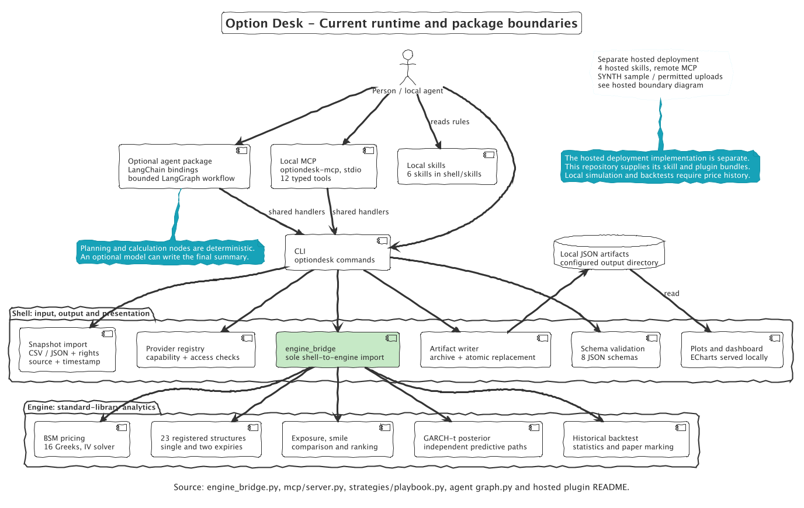
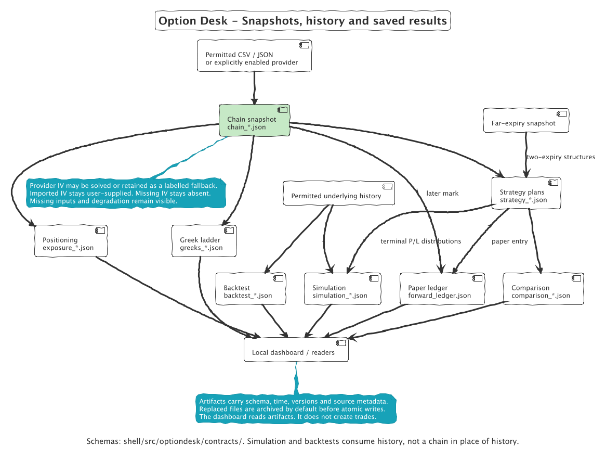
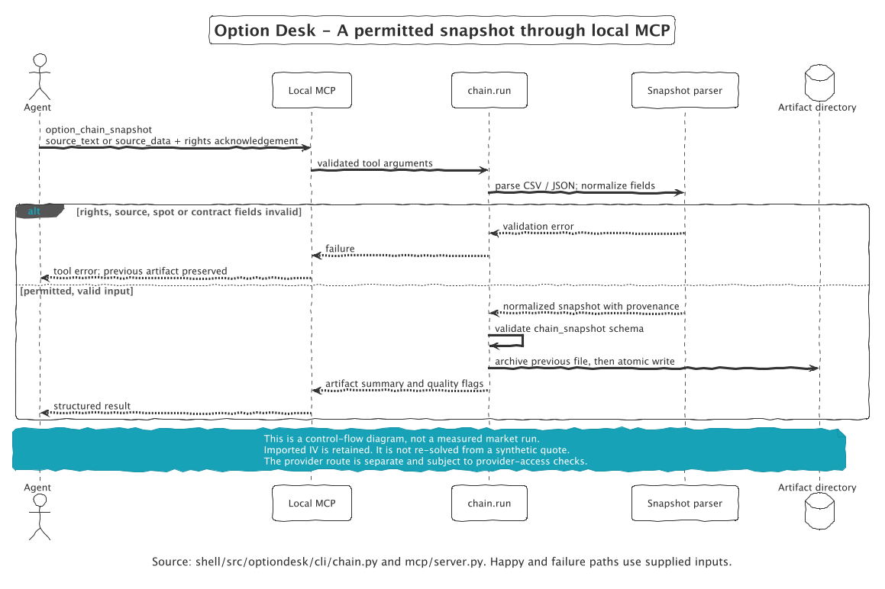
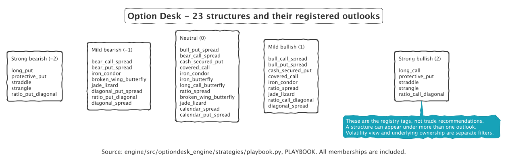
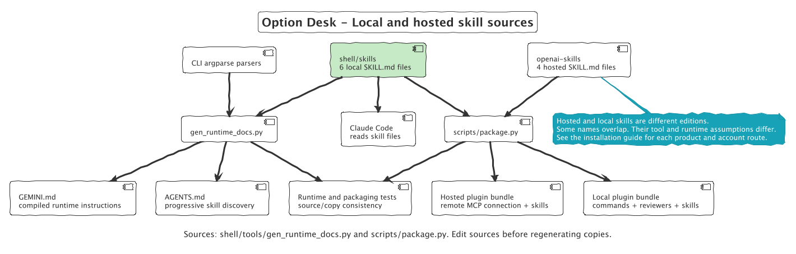
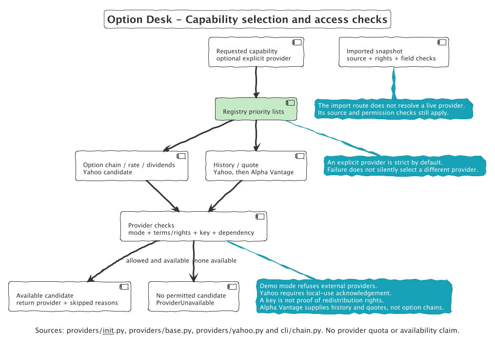
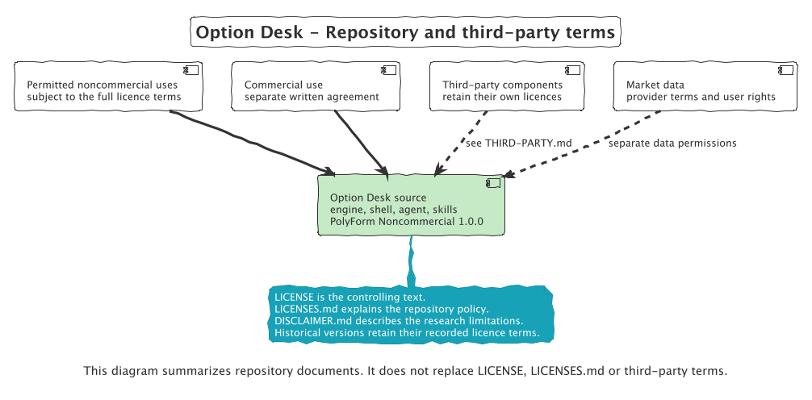

# Architecture diagram gallery

[Architecture guide](../wiki/Architecture.md) | [Documentation home](../README.md)

These diagrams describe the implementation reviewed at revision `79e8d7f`.
Each diagram has editable PlantUML, a scalable SVG, and a PNG preview.
The sources name the implementation or repository documents that support their claims.

[Original PlantUML editions](https://github.com/Iman/agent-driven-options-desk-and-skills/tree/79e8d7f/docs/diagrams) remain available at their recorded revision.
The [reference README](../wiki/Reference-README.md) preserves the earlier Mermaid drawings and historical measurements.

## Browse the diagrams

### Runtime and package boundaries

[PlantUML](01_overall_architecture.puml) | [SVG](01_overall_architecture.svg) | [PNG](01_overall_architecture.png)



### Artifact data flow

[PlantUML](02_artifact_data_flow.puml) | [SVG](02_artifact_data_flow.svg) | [PNG](02_artifact_data_flow.png)



### Snapshot request: success and failure

[PlantUML](03_single_run_sequence.puml) | [SVG](03_single_run_sequence.svg) | [PNG](03_single_run_sequence.png)



### All registered structure outlooks

[PlantUML](04_structures_by_outlook.puml) | [SVG](04_structures_by_outlook.svg) | [PNG](04_structures_by_outlook.png)



### Local and hosted skill sources

[PlantUML](05_one_source_of_truth.puml) | [SVG](05_one_source_of_truth.svg) | [PNG](05_one_source_of_truth.png)



### Provider capability and access checks

[PlantUML](06_provider_registry.puml) | [SVG](06_provider_registry.svg) | [PNG](06_provider_registry.png)



### Repository and third-party terms

[PlantUML](07_licensing.puml) | [SVG](07_licensing.svg) | [PNG](07_licensing.png)



### Local and hosted connections

[PlantUML](08_hosted_boundary.puml) | [SVG](08_hosted_boundary.svg) | [PNG](08_hosted_boundary.png)


### Test layers and unit coverage

[PlantUML](09_testing_layers.puml) | [SVG](09_testing_layers.svg) | [PNG](09_testing_layers.png)


### Bounded LangGraph workflow

[PlantUML](10_bounded_workflow.puml) | [SVG](10_bounded_workflow.svg) | [PNG](10_bounded_workflow.png)


### Watch and completion loops are command instructions

[PlantUML](11_research_loops.puml) | [SVG](11_research_loops.svg) | [PNG](11_research_loops.png)


### Prompt construction and the optional model boundary

[PlantUML](12_prompt_assembly.puml) | [SVG](12_prompt_assembly.svg) | [PNG](12_prompt_assembly.png)


### Historical backtest from prices to uncertainty

[PlantUML](13_backtest_workflow.puml) | [SVG](13_backtest_workflow.svg) | [PNG](13_backtest_workflow.png)


### Forward paper testing and ledger states

[PlantUML](14_forward_paper_lifecycle.puml) | [SVG](14_forward_paper_lifecycle.svg) | [PNG](14_forward_paper_lifecycle.png)


## Rebuild locally

Requirements: PlantUML and Graphviz. From the repository root:

```sh
plantuml -failfast2 -nometadata -tsvg docs/diagrams/*.puml
plantuml -failfast2 -nometadata -tpng docs/diagrams/*.puml
```

All diagrams use the PlantUML `sketchy-outline` theme on a white background.
The shared style is in [theme.iuml](theme.iuml).
Review both the source labels and rendered images after each update.
Do not rewrite historical reference pages to describe current behavior.
