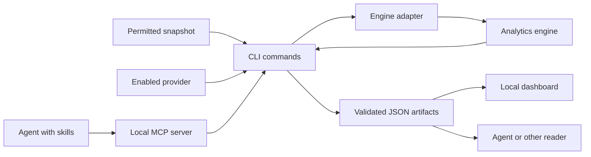
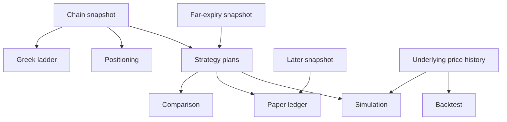
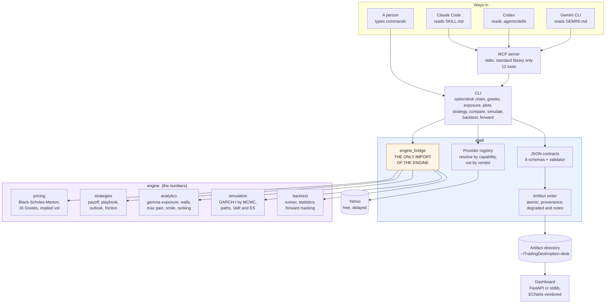
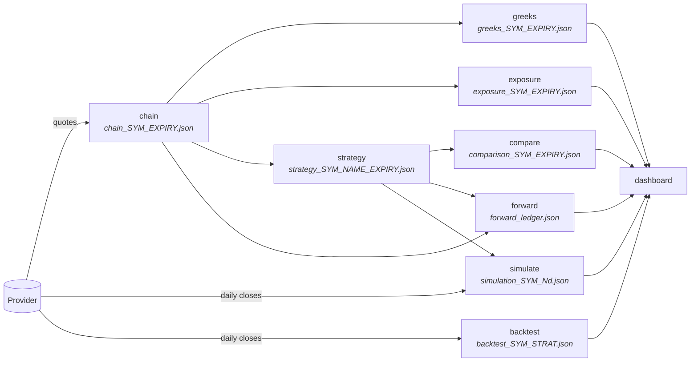
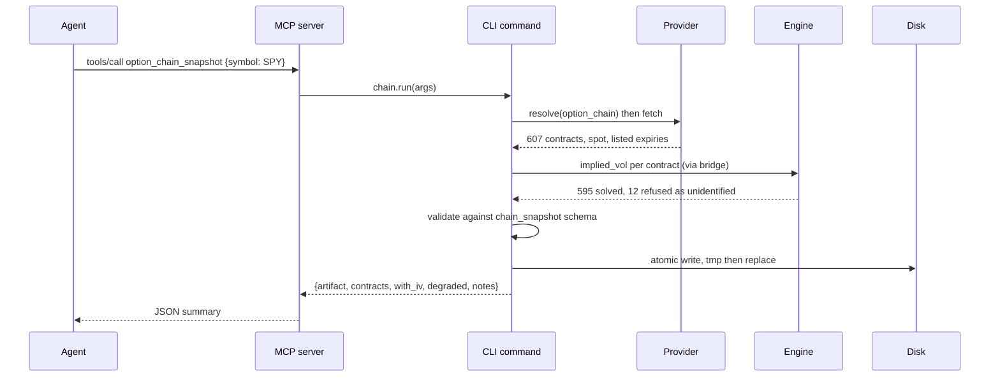
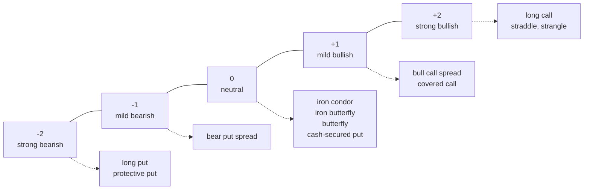
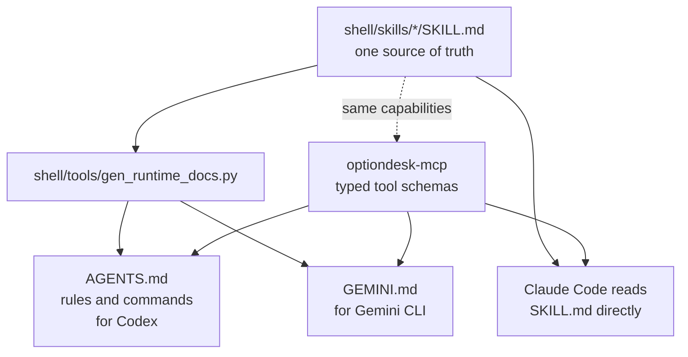
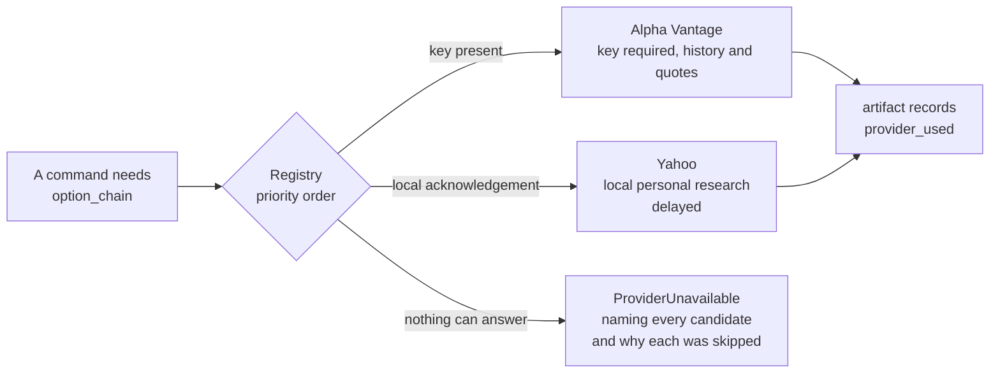
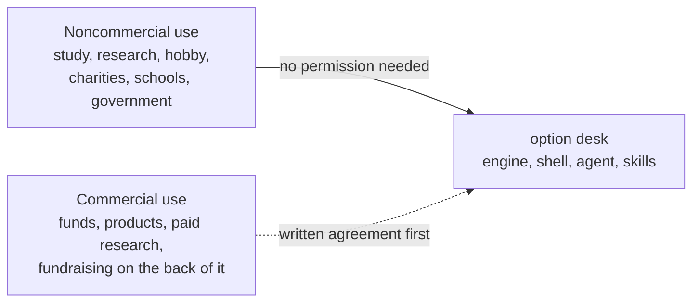

# Architecture and artifacts

[Guide home](Home.md) | [API inventory](../INVENTORY.md) | [Development](Development.md)

## Detailed reference and preserved content

The earlier long-form documentation remains available here in full:

| Preserved page | Includes |
|---|---|
| [Project reference](Reference-README.md) | Original architecture, seven diagrams, mathematics, providers, asset classes, extension points, audit findings, screenshots, examples, and licensing discussion. |
| [Earlier FAQ](Reference-FAQ.md) | Original questions, explanations, measurements, and research caveats. |
| [Earlier installation guide](Reference-INSTALL.md) | Previous setup routes and their recorded verification notes. |

These pages preserve revision `9626273`, immediately before the guide rewrite.
They retain historical claims as historical material. Use [skill installation](Skill-Installation.md) for current setup steps.
The [preservation manifest](../reference-preservation.json) records source hashes and diagram counts.

Read the original [design rationale](Reference-README.md#architecture), [data flow](Reference-README.md#how-data-flows),
[artifact contracts](Reference-README.md#artifacts-and-contracts), [extension guide](Reference-README.md#extending-it),
and [engineering verification notes](Reference-README.md#what-has-been-verified).

## Calculation path

## Packages

| Package | Responsibility | Source |
|---|---|---|
| Engine | Pricing, Greeks, strategies, exposure, simulation, and backtest mathematics | `engine/src/optiondesk_engine/` |
| Shell | Providers, import, commands, validation, files, plots, MCP, and dashboard | `shell/src/optiondesk/` |
| Optional agent package | LangChain bindings and a bounded LangGraph workflow | `agent/src/optiondesk_agent/` |

The shell reaches the engine through `engine_bridge.py`.
All packages use the repository license.
The hosted service is a separate deployment with its own connection and data policy.

## Artifact flow

Simulation and backtests require price history.
A chain snapshot does not replace that input.

## Contracts

| Schema | Filename pattern | Contents |
|---|---|---|
| `chain_snapshot` | `chain_*.json` | Contracts, quotes, IV sources, and input provenance. |
| `greeks_ladder` | `greeks_*.json` | Sensitivities, units, and skip counts. |
| `exposure` | `exposure_*.json` | Gamma exposure, walls, flip, ratios, and smile. |
| `strategy_plan` | `strategy_*.json` | Legs, payoff, probabilities, Greeks, and friction. |
| `strategy_comparison` | `comparison_*.json` | Ranked plans and comparison assumptions. |
| `simulation` | `simulation_*.json` | Posterior, diagnostics, fan, and tail risk. |
| `backtest` | `backtest_*.json` | Trades, statistics, uncertainty, and benchmark. |
| `forward_ledger` | `forward_ledger.json` | Paper positions, marks, and settlements. |

The `meta` block records generation time, tool, versions, source, quality flags, notes, and policy statements.
Each producer validates its artifact before writing it.
The dashboard reads those artifacts.

## File locations and replacement

The normal artifact directory is `~/TradingDesk/option-desk`.
`--out-dir` selects another directory for a command.
`OPTIONDESK_ARTIFACTS` selects the default directory for a process.
The demo runner uses `~/TradingDesk/option-desk-demo` unless configured otherwise.

When a named artifact changes, the outgoing version moves under `archive/<date>/`.
The current filename remains stable for readers.
`OPTIONDESK_ARCHIVE=0` disables that archival behavior.
The project does not prune your archive automatically.

## Sources of documentation

Local skills live in `shell/skills/`.
The generated runtime files and plugin copies come from those sources.
Claude command and reviewer sources live in `.claude/commands/` and `.claude/agents/`.
Hosted skills live in `openai-skills/`.

Use the [capabilities catalogue](../CAPABILITIES.md) for interfaces and the [generated inventory](../INVENTORY.md) for source symbols.
Use [Loops](../../LOOPS.md) for the bounded graph and recurring workflows.

## Restored design diagrams

The seven diagrams below come from that preserved README edition.
The package diagram uses lighter backgrounds for readable labels. The archive retains its original styling.
They are reference diagrams, not fresh test or market measurements.
The request sequence uses the recorded August 30, 2026 sample counts.
The provider drawing is schematic: Alpha Vantage supplies history and quotes, not option chains.

### Packages and runtime boundaries

### Artifacts between commands

### One MCP request from agent to disk

### Structure outlook map

### Skills and generated runtime instructions

### Provider resolution

### License boundaries

