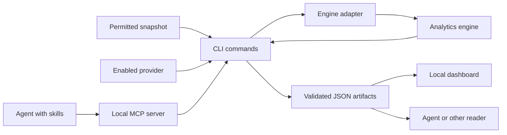
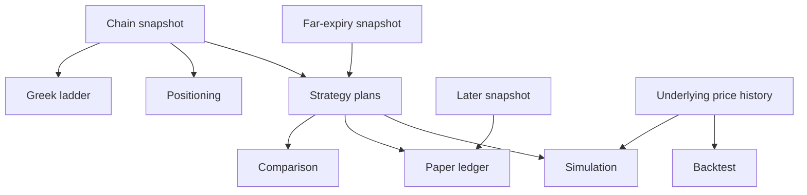

# Architecture and artifacts

[Guide home](Home.md) | [API inventory](../INVENTORY.md) | [Development](Development.md)

## Calculation path

## Packages

| Package | Responsibility | Source |
|---|---|---|
| Engine | Pricing, Greeks, strategies, exposure, simulation, and backtest mathematics | `engine/src/optiondesk_engine/` |
| Shell | Providers, import, commands, validation, files, plots, MCP, and dashboard | `shell/src/optiondesk/` |
| Optional agent package | LangChain bindings and a bounded LangGraph workflow | `agent/src/optiondesk_agent/` |

The shell reaches the engine through `engine_bridge.py`.
All packages use the repository license.
The hosted service is a separate deployment with its own connection and data policy.

## Artifact flow

Simulation and backtests require price history.
A chain snapshot does not replace that input.

## Contracts

| Schema | Filename pattern | Contents |
|---|---|---|
| `chain_snapshot` | `chain_*.json` | Contracts, quotes, IV sources, and input provenance. |
| `greeks_ladder` | `greeks_*.json` | Sensitivities, units, and skip counts. |
| `exposure` | `exposure_*.json` | Gamma exposure, walls, flip, ratios, and smile. |
| `strategy_plan` | `strategy_*.json` | Legs, payoff, probabilities, Greeks, and friction. |
| `strategy_comparison` | `comparison_*.json` | Ranked plans and comparison assumptions. |
| `simulation` | `simulation_*.json` | Posterior, diagnostics, fan, and tail risk. |
| `backtest` | `backtest_*.json` | Trades, statistics, uncertainty, and benchmark. |
| `forward_ledger` | `forward_ledger.json` | Paper positions, marks, and settlements. |

The `meta` block records generation time, tool, versions, source, quality flags, notes, and policy statements.
Each producer validates its artifact before writing it.
The dashboard reads those artifacts.

## File locations and replacement

The normal artifact directory is `~/TradingDesk/option-desk`.
`--out-dir` selects another directory for a command.
`OPTIONDESK_ARTIFACTS` selects the default directory for a process.
The demo runner uses `~/TradingDesk/option-desk-demo` unless configured otherwise.

When a named artifact changes, the outgoing version moves under `archive/<date>/`.
The current filename remains stable for readers.
`OPTIONDESK_ARCHIVE=0` disables that archival behavior.
The project does not prune your archive automatically.

## Sources of documentation

Local skills live in `shell/skills/`.
The generated runtime files and plugin copies come from those sources.
Claude command and reviewer sources live in `.claude/commands/` and `.claude/agents/`.
Hosted skills live in `openai-skills/`.

Use the [capabilities catalogue](../CAPABILITIES.md) for interfaces and the [generated inventory](../INVENTORY.md) for source symbols.
Use [Loops](../../LOOPS.md) for the bounded graph and recurring workflows.
